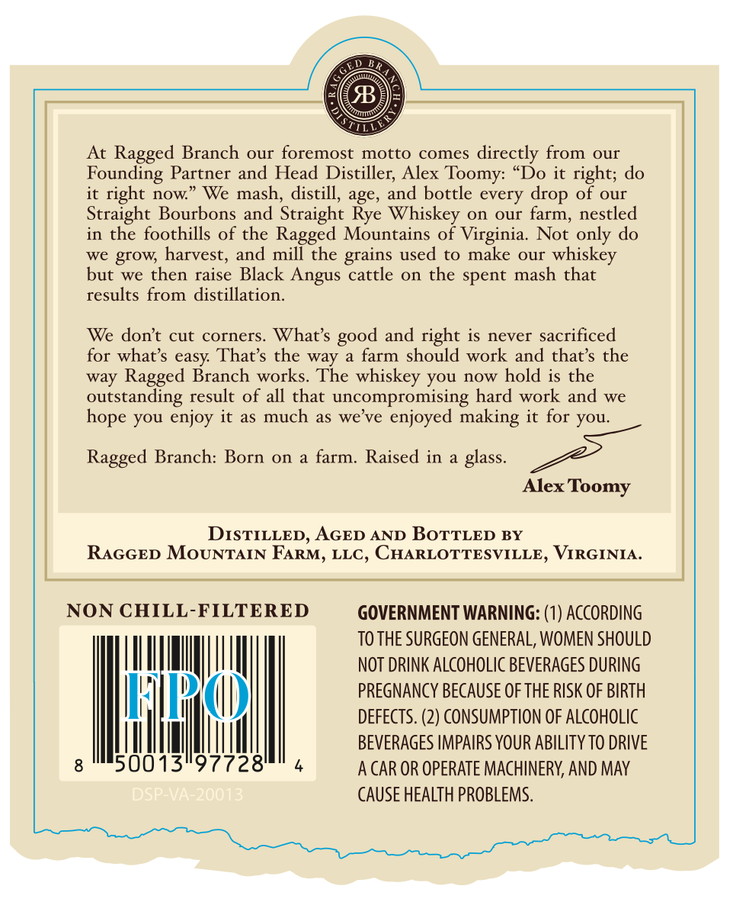
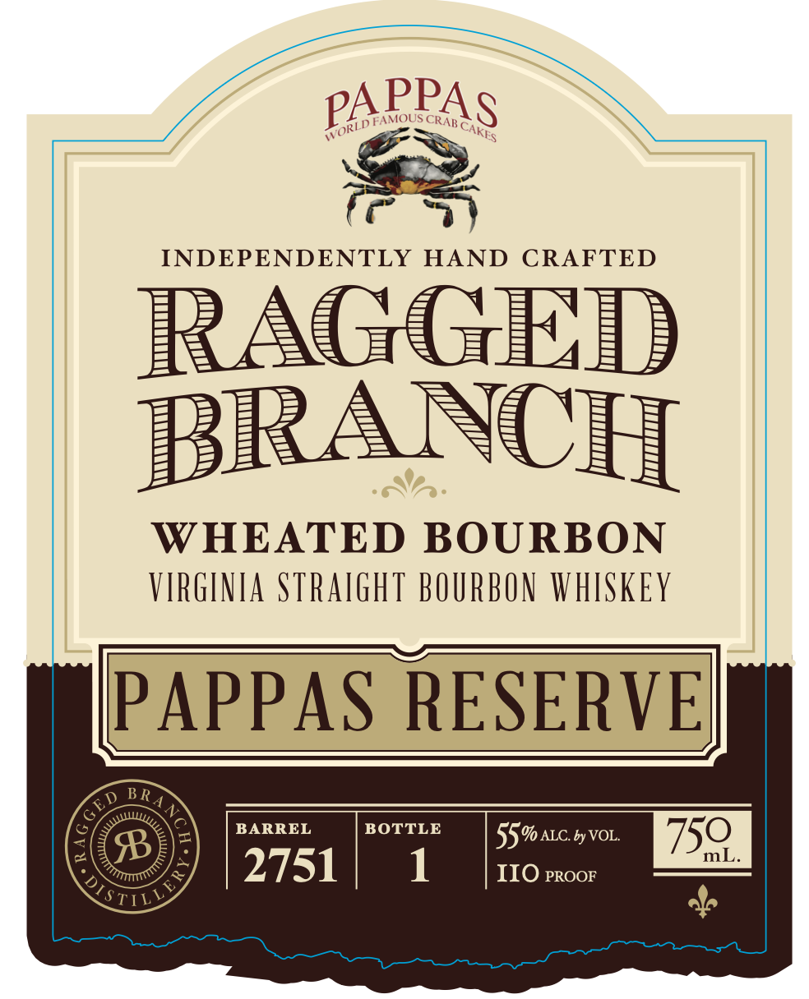

# TTB COLA Label Images - TTBID 26083001000623

**Brand Name:** RAGGED BRANCH

**Fanciful Name:** PAPPAS RESERVE

**Issue Date:** 03/25/2026

**Origin Code:** 05

**Product Class/Type:** 101

**Source:** [TTB Public COLA Registry](https://ttbonline.gov/colasonline/viewColaDetails.do?action=publicFormDisplay&ttbid=26083001000623)

## Label Images

### Back Label

### Front Label

## Extracted Label Text

*Text extracted via OCR - may contain errors*

**Detected Proof:** 110

### Back Label

B
At Ragged Branch
our foremost motto comes
directly from
our
Founding Partner and Head Distiller; Alex Toomy:
'Do it right; do
it right now
We mash, distill, age, and bottle
of our
Straight Bourbons and Straight Rye Whiskey_on
our
farm, nestled
in the foothills of the Ragged Mountains of Virginia.
Not only do
we grow; harvest, and mill the
used to
make our
whiskey
but we then raise Black
cattle
on the spent mash that
results from distillation.
We dont cut corners
What s
and right is never sacrificed
for whats easy That's the way
farm should work and thats the
way Ragged Branch works. The whiskey you now hold is the
outstanding result of all that uncompromising hard work and we
you enjoy it as much
as we ve
enjoyed making it for you:
Ragged Branch:
on
a farm. Raised in
glass_
Alex
Toomy
DISTILLED, AGED AND BOTTLED BY
RAGGED MOUNTAIN FARM, LLC, CHARLOTTESVILLE, VIRGINIA:
NON CHILL-FILTERED
GOVERNMENT WARNING: (1) ACCORDING
TO THE SURGEON GENERAL, WOMEN SHOULD
NOT DRINK ALCOHOLIC BEVERAGES DURING
HKRKM
PREGNANCY BECAUSE OF THE RISK OF BIRTH
DEFECTS. (2) CONSUMPTION OF ALCOHOLIC
BEVERAGES IMPAIRS YOUR ABILITY TO DRIVE
50013"97728'
A CAR OR OPERATE MACHINERV, AND May
DSp23
CAUSE HEALTH PROBLEMS.
drop
every
grains
Angus
good
hope
Born

### Front Label

INDEPENDENTLY
HAND
CRAFTED
RAGGED
BRANCH
WHEATED BOURBON
VIRGINIA STRAIGhT BOURBON WHISKEY
PAPPAS RESERVEL
B R
BARREL
BOTTLE
55% ALC by VOL
750
B
mL
2751
1
IIO PROOF
STIL
PPAs
PA
WORLD FAMOUS
CRAB €
CAKES
ED
