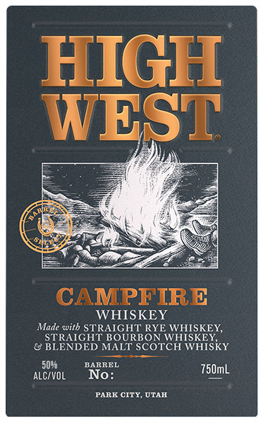
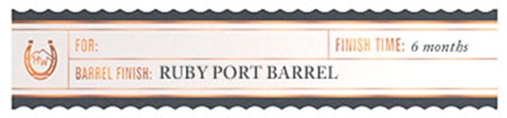

# TTB COLA Label Images - TTBID 26083001000650

**Brand Name:** HIGH WEST

**Fanciful Name:** CAMPFIRE BARREL SELECT

**Issue Date:** 04/06/2026

**Origin Code:** 45

**Product Class/Type:** 140

**Source:** [TTB Public COLA Registry](https://ttbonline.gov/colasonline/viewColaDetails.do?action=publicFormDisplay&ttbid=26083001000650)

## Label Images

### Back Label

### Label 3

## Extracted Label Text

*Text extracted via OCR - may contain errors*

### Back Label

TT Z
J § Ss Ld
va ‘ama |
iN | IN
y oe ed
oN
( Bea RA
NAR ESS OK
eI a4
CAMPFIRE
WHISKEY
Made with STRAIGHT RYE WHISKEY,
STRAIGHT BOURBON WHISKEY,
& BLENDED MALT SCOTCH WHISKY
50% BARREL
acvol No: ison
PARK CITY, UTAH

### Label 3

——————————
( ) FOR FINISH TIME: 6 months
BABREL FINISH: RUBY PORT BARREL
ja ies
