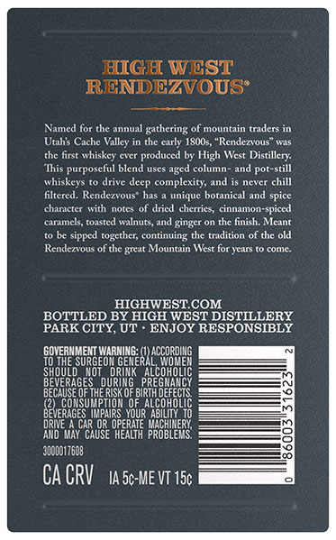
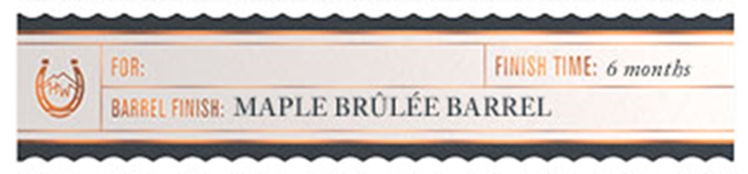

# TTB COLA Label Images - TTBID 26083001000667

**Brand Name:** HIGH WEST

**Fanciful Name:** RENDEZVOUS BARREL SELECT

**Issue Date:** 03/26/2026

**Origin Code:** 45

**Product Class/Type:** 122

**Source:** [TTB Public COLA Registry](https://ttbonline.gov/colasonline/viewColaDetails.do?action=publicFormDisplay&ttbid=26083001000667)

## Label Images

### Back Label

### Label 3

## Extracted Label Text

*Text extracted via OCR - may contain errors*

### Back Label

MIGH WEST
RENDEZVOUS’

Named for the annual gathering of mountain traders in
Utah's Cache Valley in the early 1800s, “Rendezvous” was
the first whiskey ever produced by High West Distillery.
“This purposeful blend uses aged column- and pot-still
whiskeys to drive deep complexity, and is never chill
filtered. Rendezvous" has a unique botanical and spice
character with notes of dried cherries, cinnamon-spiced
‘caramels, toasted walnuts, and ginger on the finish. Meant
to be sipped together, continuing the tradition of the old
Rendezvous of the great Mountain West for years to come.

HIGHWEST.COM.
BOTTLED BY HIGH WEST DISTILLERY
PARK CITY, UT - ENJOY RESPONSIBLY

SovENMENT aru: cxoRON
TO THE SURGEON GENERAL WOMEN
SHOULD NOT DRINK ALCOHOLIC
BEVERAGES DURING. PREGNANCY
BECAUSE OFTHE RISK OF BIRTH DEFECTS.
(2 CONSUMPTION OF ALCOHOL

IERAGES IMPAIRS YOUR ABILITY. 10
DRIVE A CAR OR OPERATE MACHINERY,
‘AND MAY CAUSE HEALTH PROBLEMS.

‘000017608

CACRV taso-ME VT 156

### Label 3

Bote eee EE eee
FOR FINISH TIME: 6 months
@ | BARREL FlllISH: MAPLE BRULEE BARREL
ei Roce
