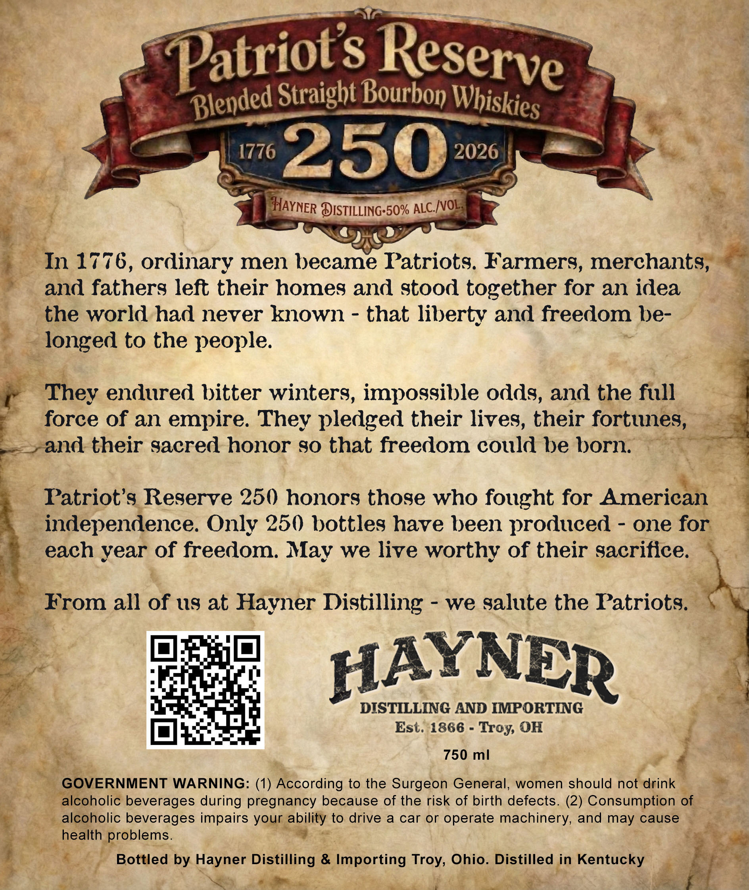
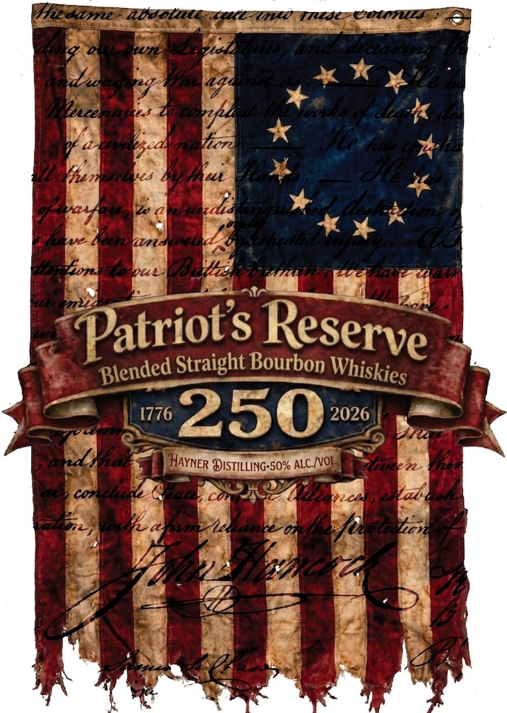

# TTB COLA Label Images - TTBID 26083001000745

**Brand Name:** HAYNER DISTILLING

**Fanciful Name:** PATRIOT'S RESERVE 250

**Issue Date:** 04/01/2026

**Origin Code:** 09

**Product Class/Type:** 121

**Source:** [TTB Public COLA Registry](https://ttbonline.gov/colasonline/viewColaDetails.do?action=publicFormDisplay&ttbid=26083001000745)

## Label Images

### Back Label

### Label 1

## Extracted Label Text

*Text extracted via OCR - may contain errors*

**Detected Proof:** 100

### Back Label

Patriots
Straight Bourbon
1776
250
2026
HAYNER DISTILLING-50%
In 1776, ordinary men became Patriots. Farmers, merchants,
and fathers left their homes and stood together for an idea
the world had never known
that liberty and freedom be-
longed to the people.
They endured bitter winters, impogsible odds, and the full
force 0f an
empire. They pledged their lives, their fortunes,
and their gacred honor g0 that freedom could he horn.
Patriot'9 Regerve 250 honors thoge who fought for American
independence. Only 250 bottles have been produced
one for
each year of freedom:
we live worthy of their sacrifice.
From all of us at Hayner Distilling
we salute the Patriots.
HAYNER
DISTILLING AND IMPORTING
Est: 1866
OH
750 ml
GOVERNMENT WARNING: (1) According to the Surgeon General, women should not drink
alcoholic beverages during pregnancy because of the risk of birth defects. (2) Consumption of
alcoholic beverages impairs your ability to drive
a car or
operate machinery, and may cause
health problems.
Bottled by Hayner Distilling & Importing
Ohio_
Distilled in Kentucky
Reserve
Blended
Whiskies
ALC_IvOL
May
Troy
Troy,

### Label 1

#edase
@bdote
Ct-lnd Tnede
butoe
Di`
Fiun
eol
S
eed
La
g
lelcerabs
Unoail
@siea
3a
ior
S
3
47E
InAues
et
Vl
ptf
Jo
azdu
Ene UnaiZ
i
3
fii
Vpuld>
For
12
Patriots
Straight Bourbon
1776
250
2026
4
dsea
HAYNER DISTILLING-50% ALC_NOL
Uae
Fal
3
cony%

Coi
KInaa
Yabl
3
duyledA AeO
fuenhan
4
Mee
S
7g4
af4
Reserve
Blended
Whiskies
Vnn
