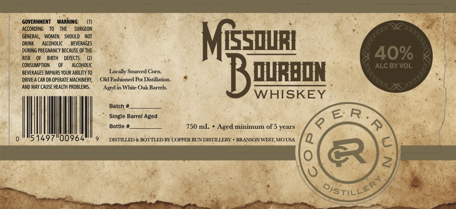

# TTB COLA Label Images - TTBID 26083001000844

**Brand Name:** COPPER RUN DISTILLERY

**Fanciful Name:** MISSOURI BOURBON

**Issue Date:** 03/25/2026

**Origin Code:** 29

**Product Class/Type:** 141

**Source:** [TTB Public COLA Registry](https://ttbonline.gov/colasonline/viewColaDetails.do?action=publicFormDisplay&ttbid=26083001000844)

## Label Images

### Label 1

## Extracted Label Text

*Text extracted via OCR - may contain errors*

**Detected Proof:** 80
**Detected Age:** 5 Years

### Label 1

GOVERMMENT
WARNING:
ACCORDING
SURGEON
GENERAL,
VIDMIEN
ShouLD
DRINK
AlcohoLIC
BEVERAGES
MGEsquRi
DURING PREG MANCY BECAUSE €F The
40%
RLSK
BIRTH
DEFECTS:
CONSUMPTION
ALCOHOLIC
ALC BY VOL
BEVERAGES IMPAIRS YOUR AbilITy TO
Locally Sourccd Corn:
BQuReqn
DRIVE A CAR €R OPERATE MACHIMERY;
Old Fashioncd Pot Distillation
AND May CAuSe HEALTH PROBLEMS.
Whitc Oak Barrcls:
WHISKEY
Batch .
Single Barrel Aged
E' R
Bottle
750 mL
Aged minimum of 5 years
4
51497
00964
DISTILED & BOTTLED BY COFPER RUN DISTILERY
BRANSON WEST MOUSA
2
'oistilles
8
Aqdin "
