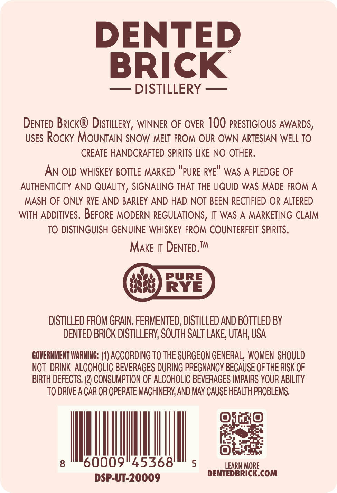
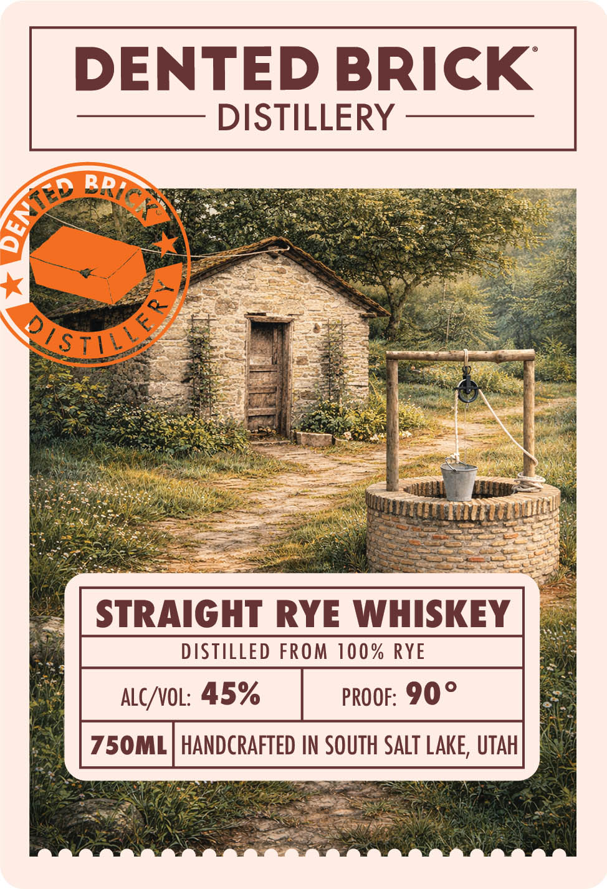

# TTB COLA Label Images - TTBID 26083001000853

**Brand Name:** DENTED BRICK DISTILLERY

**Issue Date:** 03/26/2026

**Origin Code:** 45

**Product Class/Type:** 102

**Source:** [TTB Public COLA Registry](https://ttbonline.gov/colasonline/viewColaDetails.do?action=publicFormDisplay&ttbid=26083001000853)

## Label Images

### Back Label

### Front Label

## Extracted Label Text

*Text extracted via OCR - may contain errors*

**Detected Proof:** 90

### Back Label

DENTED
BRICK
DISTILLERY
DENTED Brick@ Distillery, WINNER OF OVER 100 PRESTIGIOUS AWARDS ,
USES Rocky MOUNTAIN SNOW MELT FROM OUR OWN ARTESIAN WELL TO
CREATE HANDCRAFTED SPIRITS LIKE NO OTHER,
AN OLD WHISKEY BOTTLE MARKED
RYE"
WAS A PLEDGE OF
AUTHENTICITY AND QUALITY, SIGNALING THAT THE LIQUID WAS MADE FROM A
MASH OF ONLY RYE AND BARLEY AND HAD NOT BEEN RECTIFIED OR ALTERED
WITH ADDITIVES . BEFORE MODERN REGULATIONS, IT WAS A MARKETING CLAIM
TO DISTINGUISH GENUINE WHISKEY FROM COUNTERFEIT SPIRITS.
MAKE IT DENTED TM
PURE
RYE
DISTILLED FROM GRAIN; FERMENTED; DISTILLED AND BOTTLED BY
DENTED BRICK DISTILLERY; SOUTH SALT LAKE, UTAH; USA
GOVERNHENT IARNING: (V) ACCORDING TO ThE SURGEON GENERAL,  WOMEN SHOULD
NOT  DRINK  ALCOHOLIc BEVERAGES DURING PREGNANCY BECAUSE OF THE RISK OF
BIRTH DEFECTS. (2} CONSUMPTION OF ALCOHOLIC BEVERAGES IMPAIRS YOUR ABILITY
TO DRIVEA CAR OR OPERATE MACHINERY; AND MAY CAUSE HEALTH PROBLEMS.
8
60009"45368
5
LEARN MORE
DENTEDBRICK.COM
DSP-UT-20009
"PuRE

### Front Label

DENTED BRICK

——— DISTILLERY ————

STRAIGHT RYE WHISKEY

DISTILLED FROM 100% RYE

ALC/VOL: 45% proor: 90°
HANDCRAFTED IN SOUTH SALT LAKE, UTAH
