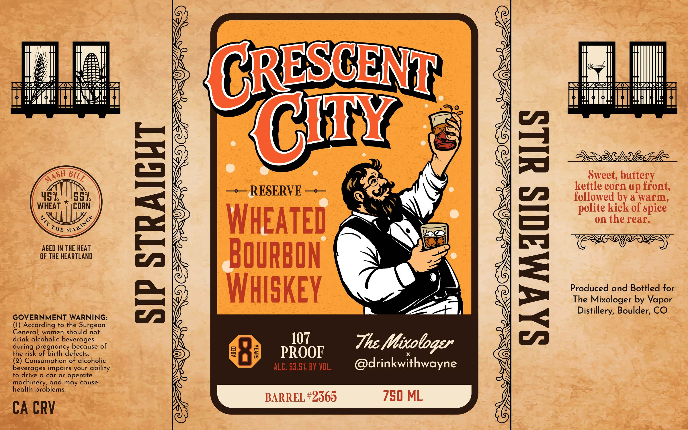

# TTB COLA Label Images - TTBID 26083001000862

**Brand Name:** CRESCENT CITY

**Issue Date:** 03/31/2026

**Origin Code:** 13

**Product Class/Type:** 141

**Source:** [TTB Public COLA Registry](https://ttbonline.gov/colasonline/viewColaDetails.do?action=publicFormDisplay&ttbid=26083001000862)

## Label Images

### Label 1

## Extracted Label Text

*Text extracted via OCR - may contain errors*

### Label 1

CRESCENT
(CIY
3
Sweet; buttery
RESERVE
kettle corn up ffont;
WHEA
Evrk
[
followed
ediek
a
ofspice
WHEATed
on the rear:
AGED IN THE HEAT
DF THE HEARTLAND
BOuRBON
5
Whiskey
1
Ptocucecofogd Bottld
for
Distillery, Boulder, CO
GOVERNMENT WARNING:
(1) According to the Surgeon
General, women should not
during pololance becgese of
107
Thc ,
Mixtoloqzr
the risk
Pof gichcYetecau
of birth
8
@
PROOF
(2) Consumption of alcoholic
@drinkwithwayne
beverages impairs your ability
ALC; 53,51 BY VOL;
to drive
a car or
operate
machinery; and may cause
health problems
BARREL #2365
750 ML
CA CRV
MASH _
BILL
polite
{
MAKINGS
THE
Vapor
