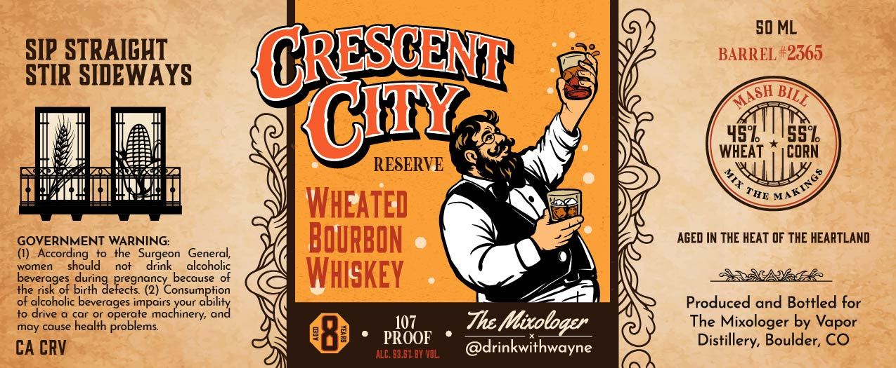

# TTB COLA Label Images - TTBID 26083001000867

**Brand Name:** CRESCENT CITY

**Issue Date:** 04/01/2026

**Origin Code:** 13

**Product Class/Type:** 141

**Source:** [TTB Public COLA Registry](https://ttbonline.gov/colasonline/viewColaDetails.do?action=publicFormDisplay&ttbid=26083001000867)

## Label Images

### Front Label

## Extracted Label Text

*Text extracted via OCR - may contain errors*

**Detected Proof:** 110

### Front Label

50 ML
SIP STRAICHT
CRESCENT
BARREL #2365
STIR SIDEWAYS
CiTY
459
55%
WHEAT
CORN
RESERVE
WHEATED
GOVERNMENT WARNING:
BOuRBON
AGED IN THE HEAT OF THE HEARTLAND
(I)   According
the   Surgeon
General,
women
should
not
drink
alcoholic
beverages
Jiutin JePeegnazyy
because of
WhiskeY
the risk of birth
of alcoholic beverages impairs
S
your
Produced and Bottled for
to drive
car Or
operate machinery;
may cause
health problems
107
Thc
Mixoloqpr
The Mixologer by
CA CRV
PROOF
@drinkwithwayne
Distillery, Boulder, CO
ALC: 53.52 BY VOL;
MASH
BILL
0
MAKINGS
THE
Vapor
