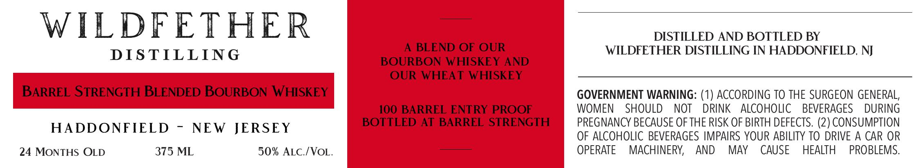

# TTB COLA Label Images - TTBID 26083001001051

**Brand Name:** WILDFETHER DISTILLING

**Issue Date:** 04/07/2026

**Origin Code:** 03

**Product Class/Type:** 131

**Source:** [TTB Public COLA Registry](https://ttbonline.gov/colasonline/viewColaDetails.do?action=publicFormDisplay&ttbid=26083001001051)

## Label Images

### Back Label

## Extracted Label Text

*Text extracted via OCR - may contain errors*

**Detected Proof:** 100

### Back Label

WILDFETHER
DISTILLED AND BOTTLED BY
BLEND OF OUR
WILDFETHER DISTILLING IN HADDONFIELD, NJ
DIS TIL LING
BOURBON WHISKEY AND
OUR WHEAT WHISKEY
BARREL STRENGTH BLENDED BOURBON WHISKEY
GOVERNMENT WARNING: (1) ACCORDING TO THE SURGEON GENERAL;
1OO BARREL ENTRY PROOF
WOMEN
SHOULD
NOT
DRINK
ALCOHOLIC
BEVERAGES
DURING
HADDONFIELD
NEW JERSEY
BOTTLED AT BARREL STRENGTH
PREGNANCY BECAUSE OFTHE RISK OF BIRTH DEFECTS. (2) CONSUMPTION
OF ALCOHOLIC BEVERAGES IMPAIRS YOUR ABILITY TO DRIVE A CAR OR
24 MONTHS OLD
375 ML
50% ALC /VoL:
OPERATE
MACHINERY;
AND
MAY
CAUSE
HEALTH
PROBLEMS.
