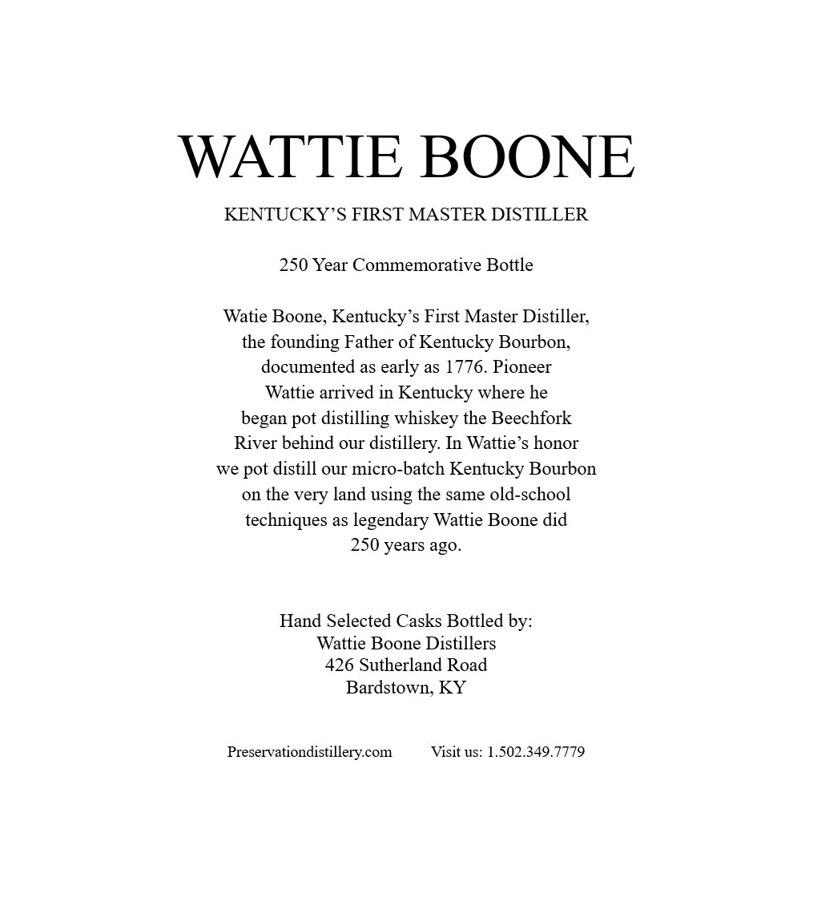
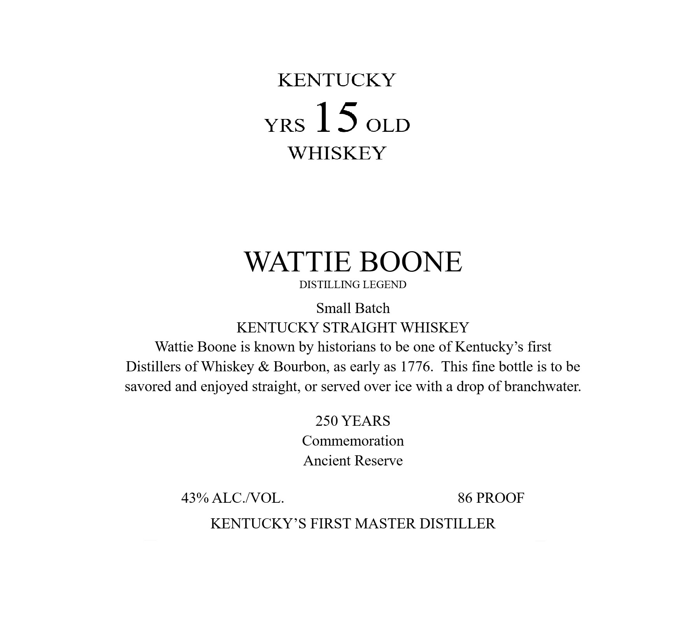

# TTB COLA Label Images - TTBID 26083001001072

**Brand Name:** WATTIE BOONE

**Issue Date:** 03/25/2026

**Origin Code:** 22

**Product Class/Type:** 109

**Source:** [TTB Public COLA Registry](https://ttbonline.gov/colasonline/viewColaDetails.do?action=publicFormDisplay&ttbid=26083001001072)

## Label Images

### Back Label

### Label 1

### Label 3

## Extracted Label Text

*Text extracted via OCR - may contain errors*

**Detected Proof:** 86

### Back Label

WATTIE BOONE
KENTUCKY'S FIRST MASTER DISTILLER
250 Year Commemorative Bottle
Watie Boone, Kentucky s First Master Distiller;
the founding Father of Kentucky Bourbon;
documented as early as 1776. Pioneer
Wattie arrived in Kentucky where he
began
distilling whiskey the Beechfork
River behind our distillery: In Wattie's honor
we
distill our micro-batch
Kentucky Bourbon
on the very land using the same old-school
techniques as legendary Wattie Boone did
250 years ago.
Hand Selected Casks Bottled by:
Wattie Boone Distillers
426 Sutherland Road
Bardstown; KY
Preservationdistillerycom
Visit uS: 1.502.349.7779
pot
pot

### Label 1

KENTUCKY

YRS 1 5 OLD

WHISKEY

WATTIE BOONE

DISTILLING LEGEND

Small Batch

KENTUCKY STRAIGHT WHISKEY

Wattie Boone is known by historians to be one of Kentucky’s first

Distillers of Whiskey & Bourbon, as early as 1776. This fine bottle is to be

savored and enjoyed straight, or served over ice with a drop of branchwater.

250 YEARS

Commemoration

Ancient Reserve

43% ALC./VOL.

86 PROOF

KENTUCKY ’S FIRST MASTER DISTILLER

### Label 3

GOVERNMENT WARNING:
ACCORDING
TO
THE
SURGEON
GENERAL
INGmEr) AGOBD8
NOT
DRINK
AicoHoLic
BEVERAGES
DURiNG
PREGNANCY
BECAUSE
OF
THE
RISK
OF
BIRTH
DEFFECTS
2
CONSUMpTION
OF
Alcohoic
BEVERAGES
IMPAIRS
YOUR
ABILITY
TO
DRIVE
A
CAR
OR
OPERATE
MACHINERY
And
MAY
CAUSE
UPC - FOR POSITION ONLY
HeALTH
PROBLEMS:
750ml
