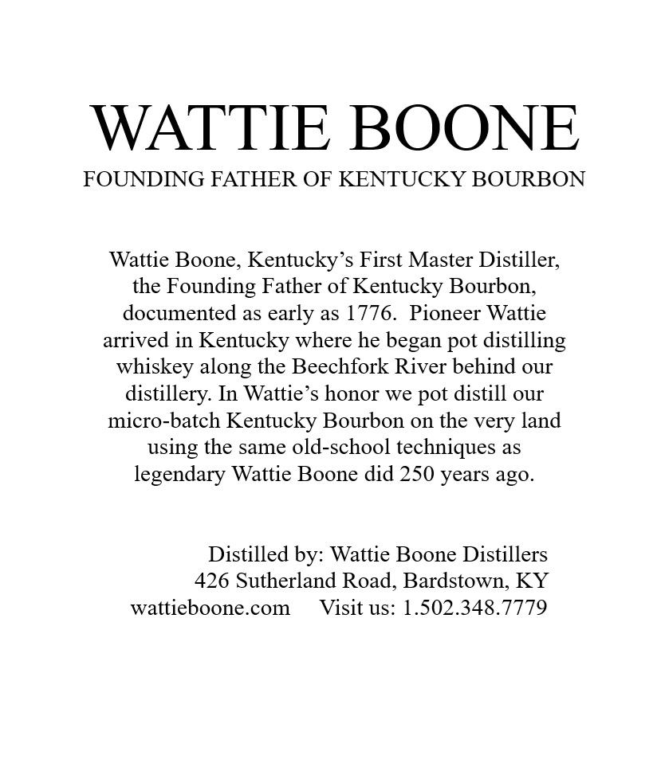
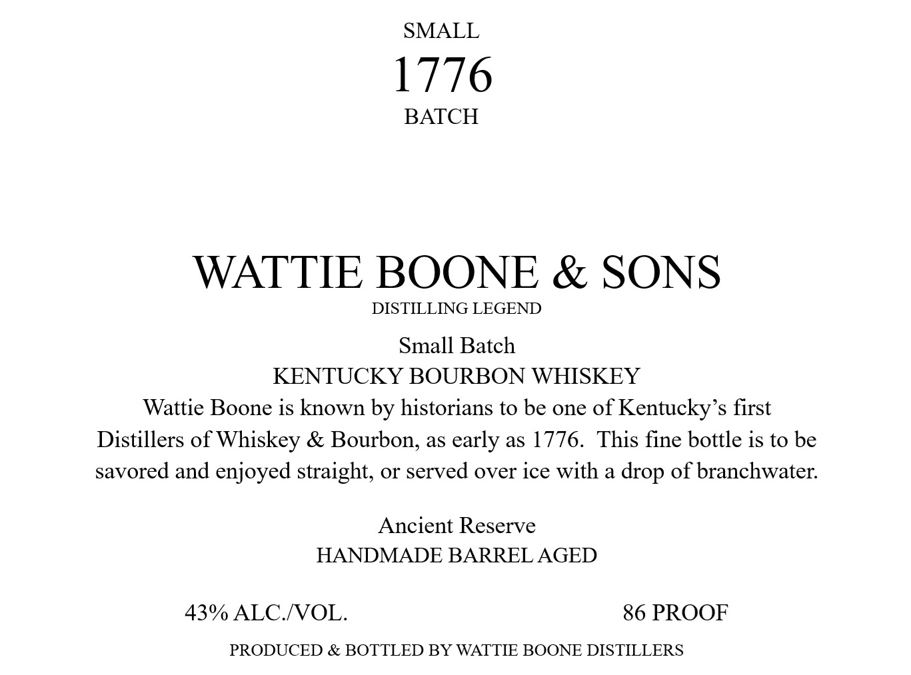

# TTB COLA Label Images - TTBID 26083001001081

**Brand Name:** WATTIE BOONE & SONS

**Issue Date:** 03/25/2026

**Origin Code:** 22

**Product Class/Type:** 141

**Source:** [TTB Public COLA Registry](https://ttbonline.gov/colasonline/viewColaDetails.do?action=publicFormDisplay&ttbid=26083001001081)

## Label Images

### Back Label

### Label 1

### Label 2

## Extracted Label Text

*Text extracted via OCR - may contain errors*

**Detected Proof:** 86

### Back Label

WATTIE BOONE

FOUNDING FATHER OF KENTUCKY BOURBON

Wattie Boone, Kentucky’s First Master Distiller,

the Founding Father of Kentucky Bourbon,

documented as early as 1776. Pioneer Wattie

arrived in Kentucky where he began pot distilling

whiskey along the Beechfork River behind our

distillery. In Wattie’s honor we pot distill our

micro-batch Kentucky Bourbon on the very land

using the same old-school techniques as

legendary Wattie Boone did 250 years ago.

Distilled by: Wattie Boone Distillers

426 Sutherland Road, Bardstown, KY

wattieboone.com Visit us: 1.502.348.7779

### Label 1

SMALL

1776

BATCH

WATTIE BOONE & SONS

DISTILLING LEGEND

Small Batch

KENTUCKY BOURBON WHISKEY

Wattie Boone is known by historians to be one of Kentucky’s first

Distillers of Whiskey & Bourbon, as early as 1776. This fine bottle is to be

savored and enjoyed straight, or served over ice with a drop of branchwater.

Ancient Reserve

HANDMADE BARREL AGED

43% ALC/VOL.

86 PROOF

PRODUCED & BOTTLED BY WATTIE BOONE DISTILLERS

### Label 2

GOVERNMENT WARNING:
ACCORDING
TO
THE
SURGEON
GENERAL
INGmEr) AGOBD8
NOT
DRINK
AicoHoLic
BEVERAGES
DURiNG
PREGNANCY
BECAUSE
OF
THE
RISK
OF
BIRTH
DEFFECTS
2
CONSUMpTION
OF
Alcohoic
BEVERAGES
IMPAIRS
YOUR
ABILITY
TO
DRIVE
A
CAR
OR
OPERATE
MACHINERY
And
MAY
CAUSE
UPC - FOR POSITION ONLY
HeALTH
PROBLEMS:
750ml
