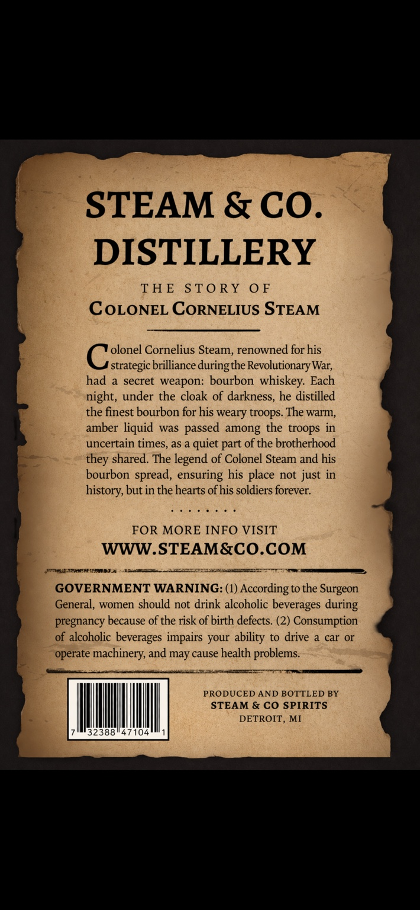
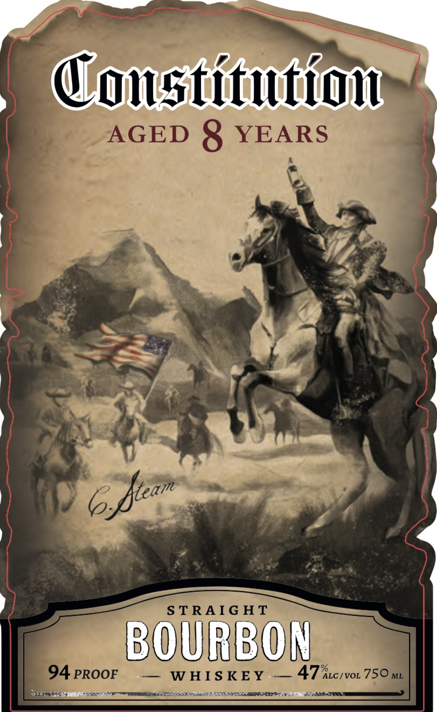
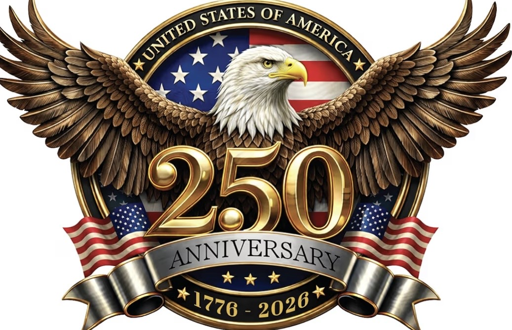
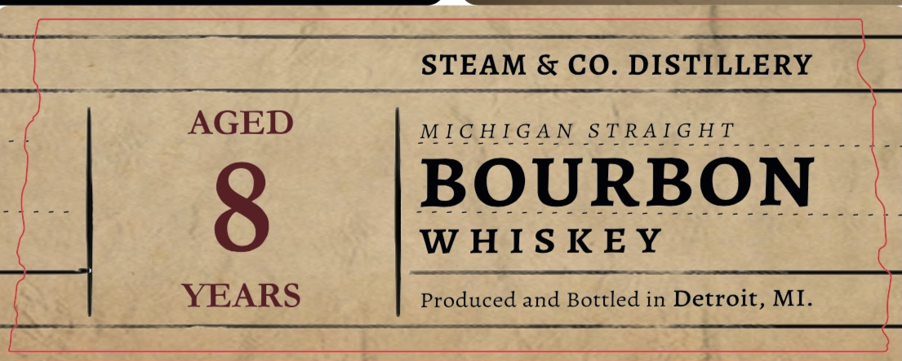

# TTB COLA Label Images - TTBID 26083001001102

**Brand Name:** CONSTITUTION

**Issue Date:** 03/31/2026

**Origin Code:** 06

**Product Class/Type:** 101

**Source:** [TTB Public COLA Registry](https://ttbonline.gov/colasonline/viewColaDetails.do?action=publicFormDisplay&ttbid=26083001001102)

## Label Images

### Back Label

### Front Label

### Label 2

### Label 3

## Extracted Label Text

*Text extracted via OCR - may contain errors*

*1 image(s) excluded: text did not meet readability threshold*

**Detected Proof:** 94
**Detected Age:** 8 Years

### Back Label

STEAM & CO_
DISTILLERY
THE
STo RY
0 F
CoLONEL CORNELIUS STEAM
olonel Cornelius Steam, renowned for his
strategic brilliance duringthe Revolutionary War;
had
a secret weapon: bourbon whiskey: Each
night, under the cloak of darkness, he distilled
the finest bourbon for his weary troops. The warm,
amber liquid was passed among the troops in
uncertain times, as a quiet part of the brotherhood
they shared: The legend of Colonel Steam and his
bourbon spread, ensuring his place not just in
history, but in the hearts ofhis soldiers forever:
FOR MORE INFO VISIT
WWW.STEAM&CO.COM
GOVERNMENT WARNING: (1) According to the Surgeon
General, women should not drink alcoholic beverages
pregnancy because of the risk of birth defects (2) Consumption
of alcoholic beverages impairs your
to drive
car Or
operate machinery, and may cause health problems.
PRODUCED AND BOTTLED BY
STEAM & CO SPIRITS
DETROIT
MI
32388
104
during
ability

### Front Label

Consticultlonu
AGED
8
YEARS
S TRAIG HT
BOURBON_
94 PROOF
WHIS KEY
47kc
IVOL
750 ML
JtOda
QDe e r Erran
6fiean

### Label 3

Bites

_STEAM & CO. DIS

TILLERY

AGED

ae ies he ea al meee aes

MICHIGAN STRAIGHT

BOURBON

rt ere See aoe rier Sy ieee Son ee

WHISKEY

YEARS

Produced and Bottled in

—
