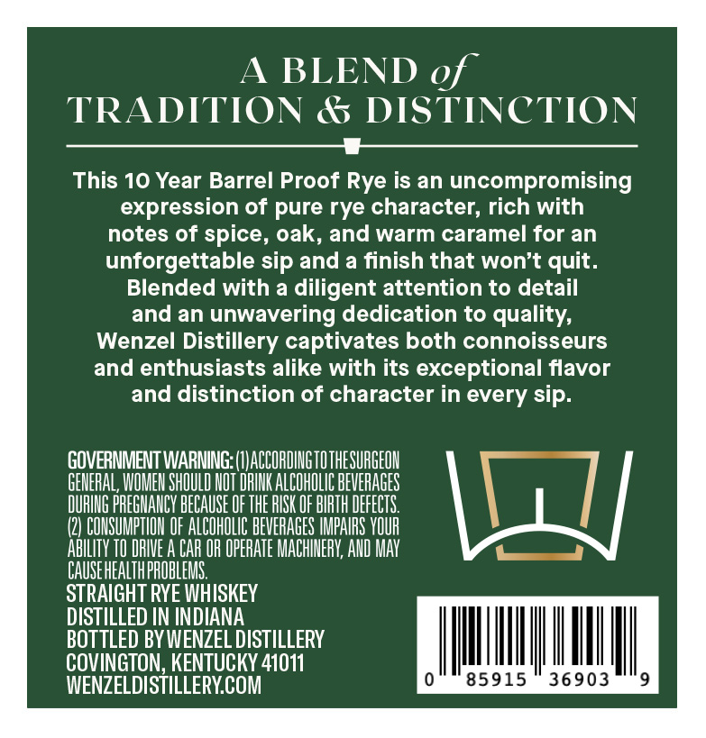
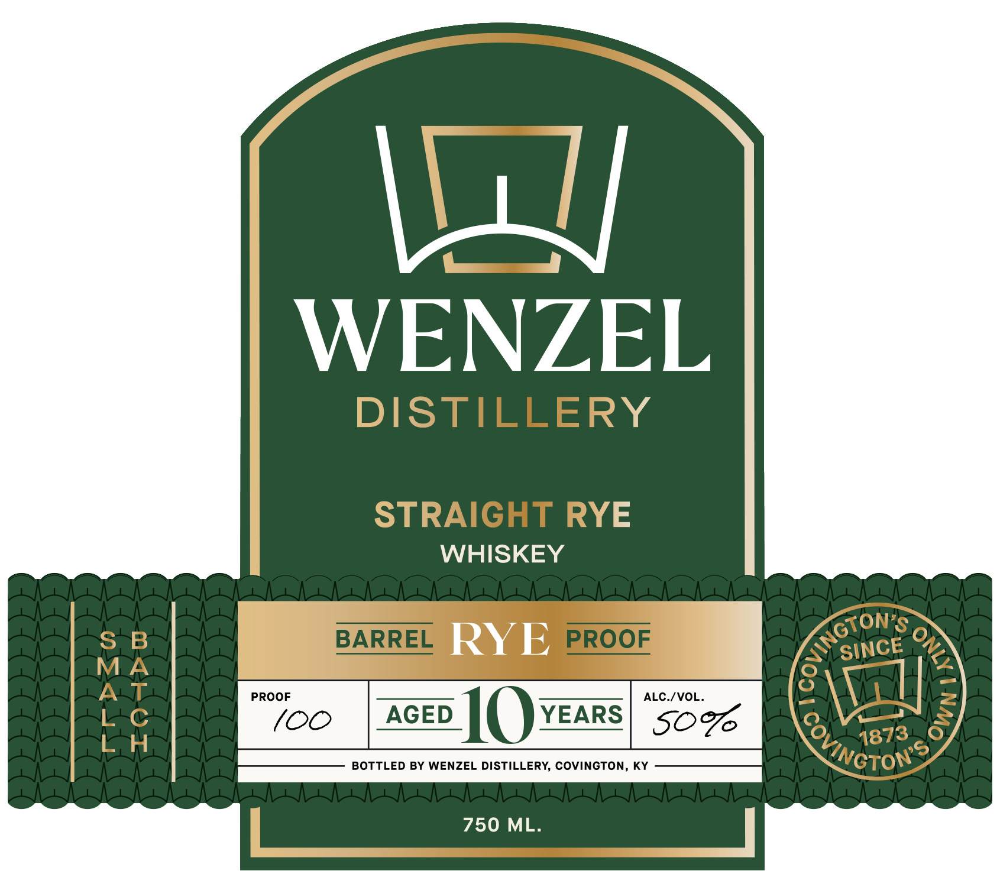
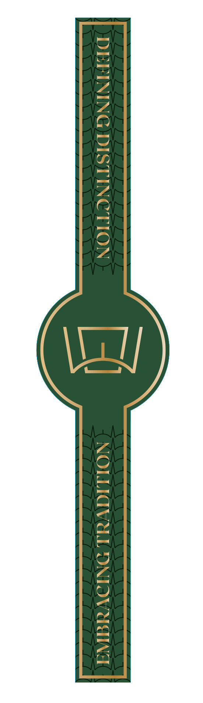

# TTB COLA Label Images - TTBID 26083001001108

**Brand Name:** WENZEL DISTILLERY

**Issue Date:** 03/25/2026

**Origin Code:** 22

**Product Class/Type:** 102

**Source:** [TTB Public COLA Registry](https://ttbonline.gov/colasonline/viewColaDetails.do?action=publicFormDisplay&ttbid=26083001001108)

## Label Images

### Back Label

### Label 1

### Label 3

## Extracted Label Text

*Text extracted via OCR - may contain errors*

*1 image(s) excluded: text did not meet readability threshold*

**Detected Age:** 10 Years

### Back Label

A
BLEND of
TRADITION
& DISTINCTION
This 10 Year Barrel Proof Rye is an uncompromising
expression of pure rye character, rich with
notes of spice, oak, and warm caramel for an
unforgettable sip and a finish that won't quit.
Blended with a diligent attention to detail
and an unwavering dedication to quality;
Wenzel Distillery captivates both connoisseurs
and enthusiasts alike with its
exceptional flavor
and distinction of character in every sip.
GOVERNMENT WARNING: (IJACCORDIUGTOTHESURGEOH
GEMERAL; WOMEH SHOULD HOT DPIHK ALCOHOLIC BEVERAGES
DURING PREGHAMCV BECAUSE OF THE RISK OF BIRTH DEFECTS
COHSUMPTIOH OF ALCOHOLIC BEVERAGES IMPARS VOUR
AbILItV TO DRIVE A CAR OR OPERATE MACHINERV; AHD MAy
CAUSEHEALTHPROBLEMS.
STRAIGHT RYE WHISKEY
DISTILLED IN INDIANA
BOTTLED BY WENZEL DISTILLERY
COVINGTON, KENTUCKY 41011
WENZELDISTILLERYCOM
85915
36903

### Label 1

L
WENZEL
DISTILLERY
STRAIGHT RYE
WHISKEY
S
B
BARREL
RYE
PROOF
MA
AT
PROOF
ALC-/VOL_
(C
Ao ]0
YEARS
S09
6
BOTTLED BY WENZEL DISTILLERY, COVINGTON, KY
750 ML.
Kngton3
0
SINCE
8
Covincto
1873
