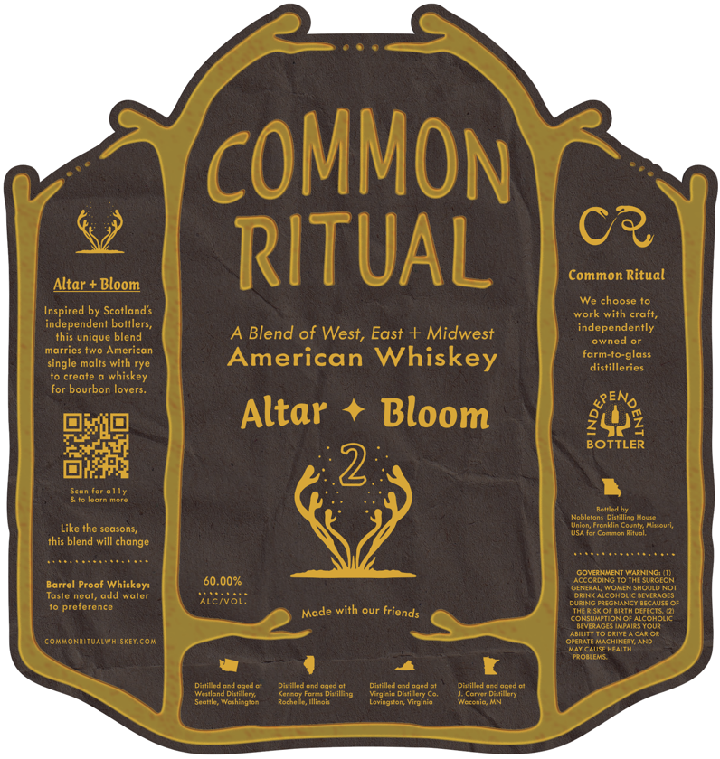

# TTB COLA Label Images - TTBID 26084001000066

**Brand Name:** COMMON RITUAL

**Issue Date:** 04/08/2026

**Origin Code:** 29

**Product Class/Type:** 140

**Source:** [TTB Public COLA Registry](https://ttbonline.gov/colasonline/viewColaDetails.do?action=publicFormDisplay&ttbid=26084001000066)

## Label Images

### Back Label

## Extracted Label Text

*Text extracted via OCR - may contain errors*

### Back Label

cOMMOn
C?
Altar + Bloom
RITUAL
Common Ritual
We choose
Inspired by Scotlands
work with craft,
indeipemique beners
A Blend of West, East + Midwest
independently
owned
marries two American
farm-to-glass
single malts with rye
American Whiskey
distilleries
create
whiskey
for bourbon lovers_
4ENo
Altar
Bloom
2443
Dii
2
BOTTLER
Seon or Ji
agtMtn
Beit
Noblctont
Oistilling Motte
Union; Uronkiin CovnirMlMouti
Like the seasons;
Conimon Rilual
this blend will change
GOVERNMENI WARNINO: (1)
60.0026
According
ThEsurcLON
Barrel Proof Whiskey:
General Women Should Not
Vostc
ncar
dicr
OptntetccmonenevecF
Duain BREHN BECEUSE
proferonco
Made with our
Thecist
Birtn @efEeCTS
CONSUMPTION GRAccholic
afTFAAOENmeenena
aln
DRIVEAC0r
comuonritualwhisketcom
OrfratfmiachineryAmd
Matcause HEalii
ROenfms
Dittilledond
Ditlitlod &nd
dod Gi
Dittilled cndagud
Dintilled ord opod 01
Wettiand Diliiiorya
Koncor Foret Dinrilline
Viaicio Dittillery Co
Ja Conct Daclillory
Jcahic Wotnindic
Racholio;IIlic ?
ringulan; Wirginic
Warenia MN
Atcivoi:
friends
Derd
