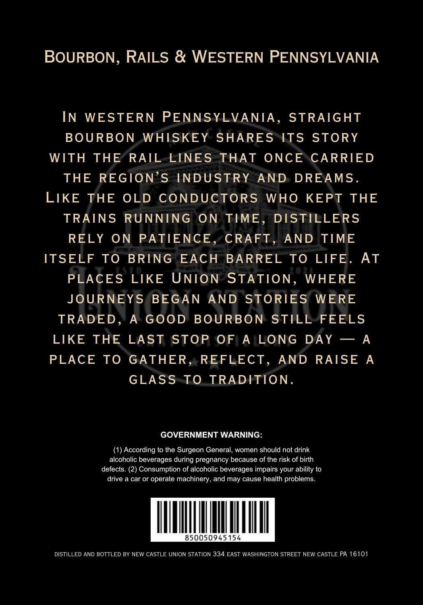
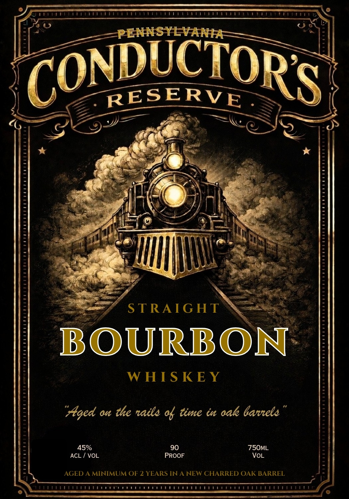

# TTB COLA Label Images - TTBID 26084001000073

**Brand Name:** PENNSYLVANIA CONDUCTOR'S RESERVE

**Issue Date:** 04/01/2026

**Origin Code:** 39

**Product Class/Type:** 101

**Source:** [TTB Public COLA Registry](https://ttbonline.gov/colasonline/viewColaDetails.do?action=publicFormDisplay&ttbid=26084001000073)

## Label Images

### Back Label

### Front Label

## Extracted Label Text

*Text extracted via OCR - may contain errors*

**Detected Proof:** 90
**Detected Age:** 2 Years

### Back Label

BOURBON, RAILS & WESTERN PENNSYLVANIA
IN
WESTERN
PENNSYLVANIA ,
STRAIGHT
BOURBON
WHISKEY
SHARES
ITS
STORY
WITH
THE
RAIL
LINES
THAT
ONCE
CARRIED
THE
REGION'S
INDUSTRY
AND
DREAMS
LIKE
THE
OLD
CONDUCTORS
WHO
KEPT
THE
TRAINS
RUNNING
ON
TIME
DISTILLERS
RELY
ON
PATIENCE
CRAFT
AND
TIME
ITSELF
To
BRING
EACH
BARREL
To
LIFE
At
PLACES
LIKE
UNION STATION ,
WHERE
JOURNEYS
BEGAN
AND
STORIES
WERE
TRADED ,
A GOOD
BOURBON
STILL FEELS
LIKE
THE
LAST
STOP
OF
A
LONG
DAY
A
PLACE
To
GATHER
REFLECT,
AND
RAISE
A
GLASS
To
TRADITION _
GOVERNMENT WARNING:
According to the Surgeon General; women should not drink
alcoholic beverages during pregnancy because of the risk of birth
defects: (2) Consumption of alcoholic beverages impairs your ability to
drive a car or operate machinery, and may cause health problems
850050945.154
DISTILLED AND BOTTLED BY NEW CASTLE UNION STATION 334 EAST WASHINGTON STREET NEW CASTLE PA 16101

### Front Label

PENNSYLVANIA
CONDECTORS
RESERVE
STRAIG HT
BOURBON
W HS KEY
"Aged a the naile % time iu aak 6arele
45%
90
75OML
ACL
VOL
PROOF
VL
AGED A MINIMUM OF 2 YEARS IN A NEW CHARRED OAK BARREL
