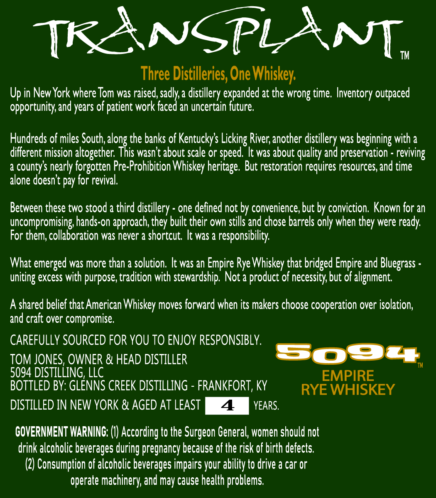
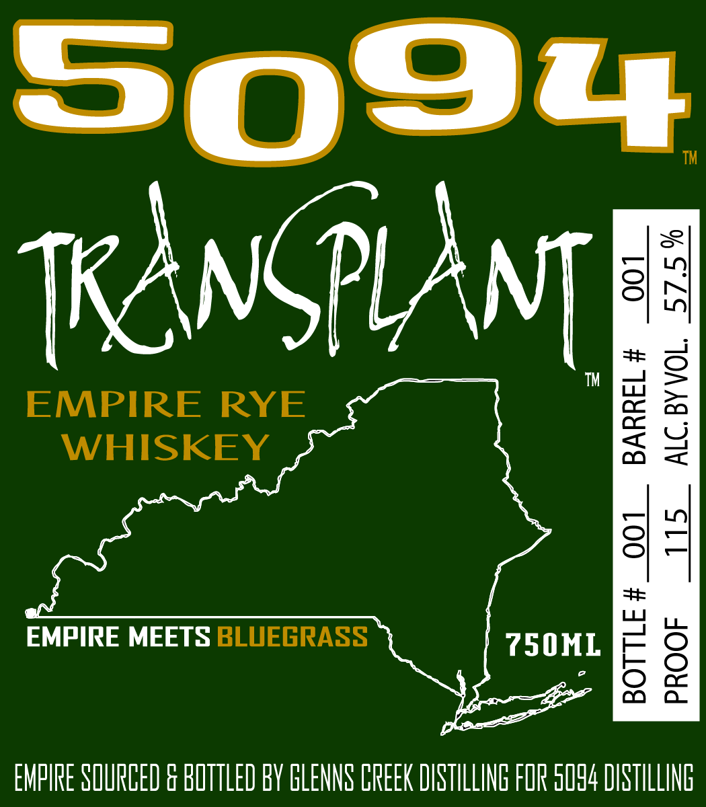

# TTB COLA Label Images - TTBID 26084001000188

**Brand Name:** 5094

**Fanciful Name:** TRANSPLANT

**Issue Date:** 03/30/2026

**Origin Code:** 22

**Product Class/Type:** 142

**Source:** [TTB Public COLA Registry](https://ttbonline.gov/colasonline/viewColaDetails.do?action=publicFormDisplay&ttbid=26084001000188)

## Label Images

### Back Label

### Label 1

## Extracted Label Text

*Text extracted via OCR - may contain errors*

### Back Label

TKANSPLAnT;
TM
Three Distilleries; One Whiskey:
Up in New York where Tom was raised, sadly a distillery
at the wrong time. Inventory outpaced
opportunity and years of patient work faced an uncertain future:
Hundreds of miles South;
the banks of Kentuckys
River; another distillery was beginning with a
different mission altogether;
alonkth
wasn t about scale or
It was about quality and preservation
a
countys nearly forgotten Pre-Prohibition Whiskey heritage  But restoration requires resources, and time
alone doesnt pay for revival,
Between these two stood a third distilery - one defined not by convenience; but by conviction: Known for an
uncompromising hands-on approach; they built their own stills and chose barrels only when
were ready:
For them; collaboration was never a shortcut; It was a responsibility:
What emerged was more than a solution , It was an Empire Rye Whiskey that bridged Empire and Bluegrass
uniting excess with purpose; tradition with stewardship. Not a
of necessity; but of alignment.
Ashared belief that American Whiskey moves forward when its makers choose cooperation over isolation;
and craft over compromise.
CAREFULLY SOURCED FOR YOU TO ENJOY RESPONSIBLY.
TOM JONES; OWNER & HEAD DISTILLER
S024
5094 DISTILLING, LLC
EMPIRE
BOTTLED BY: GLENNS CREEK DISTILLING
FRANKFORT, KY
RYE WHISKEY
DISTILLED IN NEW YORK & AGED AT LEAST
YEARS:
COVERNMENT WARNING:
According to the Surgeon General, women should not
drink alcoholic beverages during pregnancy because of the risk of birth defects:
(2) Consumption of alcoholic beverages impairs your ability to drive a car or
operate machinery; and may cause health problems.
expanded
Licking
speed.
reviving
they`
product '

### Label 1

So92

1™

S

KANGPLANT

™

EMPIRE RYE

WHISKEY

EMPIRE MEETS BLUEGRASS

7SONL

EMPIRE SOURCED & BOTTLED BY GLENNS CREEK DISTILLING FOR 0094 DISTILLING
