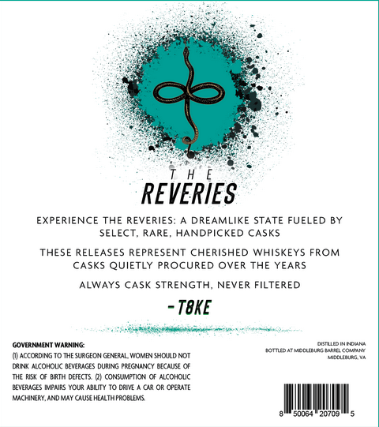
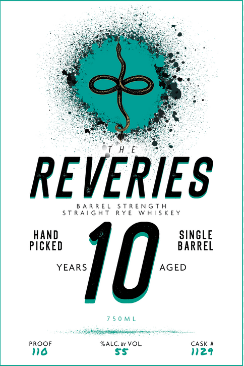

# TTB COLA Label Images - TTBID 26084001000221

**Brand Name:** REVERIES

**Issue Date:** 03/26/2026

**Origin Code:** 05

**Product Class/Type:** 142

**Source:** [TTB Public COLA Registry](https://ttbonline.gov/colasonline/viewColaDetails.do?action=publicFormDisplay&ttbid=26084001000221)

## Label Images

### Back Label

### Front Label

## Extracted Label Text

*Text extracted via OCR - may contain errors*

### Back Label

REVERIES
EXPERIENCE THE REVERIES:
DREAMLIKE STATE FUELED BY
SELECT
RARE
HANDPICKED CASKS
THESE RELEASES REPRESENT CHERISHED WHISKEYS FROM
CASKS QUIETLY PROCURED OVER THE YEARS
ALWAYS CASK STRENGTH_
NEVER FILTERED
TBKE
COVcRHUMHTWRhING
AHEcahL
Romud rdncunleeeelcdnatt
Q ACCORDINS
THE SURGEC N GERERAL WOMEN SHCULD NOT
NISELBLAL
DAINC
ACOHOUC BEVERACES DURNL
"RG UNC
BECAUS
VEFECIS
CUNnpO
ALCOHOUC
BEVERAGES [MPAIRS YOUR ABITY T0 DRVE
UR Or CPERATE
Machinery, AND MaY CAus HEALTAPRORIEMS
20702

### Front Label

ie

REVERIE

BARREL STRENGTH

STRAIGHT RYE WHISKEY

HAND

SINGLE

PICKED

BARREL

YEARS

AGED

10

750ML

hacemos min

ai

PROOF

‘ALC. 6y VOL

CASK #

nea
