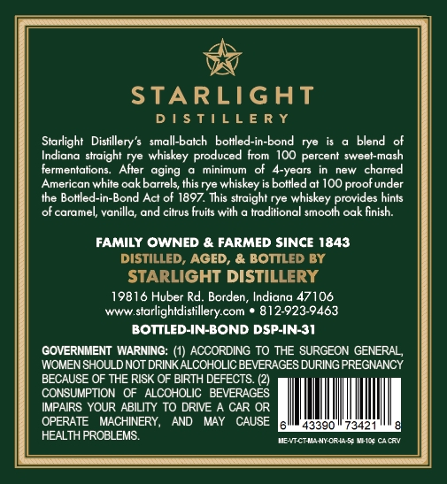
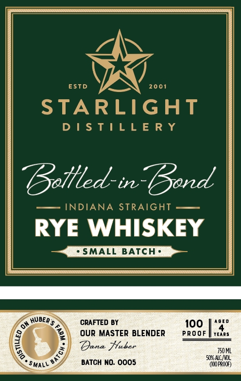

# TTB COLA Label Images - TTBID 26084001000260

**Brand Name:** STARLIGHT DISTILLERY

**Issue Date:** 03/25/2026

**Origin Code:** 19

**Product Class/Type:** 110

**Source:** [TTB Public COLA Registry](https://ttbonline.gov/colasonline/viewColaDetails.do?action=publicFormDisplay&ttbid=26084001000260)

## Label Images

### Back Label

### Front Label

## Extracted Label Text

*Text extracted via OCR - may contain errors*

### Back Label

STARLIGHT
D | $ TILL E R Y
Starlight
Distillery'$
small-batch
botlled-in-bond
rye
blend
Indiana straight rye whiskey produced
100 percent sweet-mash
fermentations:
Atter  aging
minimum
ot 4-years
new
charred
American white oak barrels, this rye whiskey is bottled at 1OO proof under
the Botlled-in-Bond Act of 1897. This straight rye whiskey provides hints
of caramel, vanilla; and citrus fruits with
traditional smooth oak finish:
FAMILY OWNED & FARMED SINCE 1843
DISTILLED;
AGED, & BOTTLED BY
STARLIGHT DISTILLERY
19816 Huber Rd_
Borden , Indiana 47106
Www
starlightdistillery com
812-923-9463
BOTTLED-IN-BOND DSP-IN-31
GOVERNMENT WARNING: (1) ACCORDING TO THE SURGEON GENERAL ,
WOMEN SHOULDNOT DRINKALCCHOLIC BEVERAGES DURING PREGNANCY
BECAUSE OF THE RISK OF BIRTH DEFECTS (2)
CONSUMPTION
ALCOHOLIC   BEVERAGES
IMPAIRS YOUR ABILITY TO DRIVE A CAR OR
OPERATE
MACHINERY,
AND
MAY
CAUSE
43390
7342
HEALTH PROBLEMS
eULHI Nt Cr4L WHC Catr
From

### Front Label

ESTD
2001
STARLIGHT
D | $ T | L L E R Y
Bottled-in Bond
INDIANA STRAIGHT
RYE WHISKEY
SMALL BATCH .
0" HUBeR $
CRAFTED BY
I00
MASTER BLENDER
PRo oF
YEARS
Dana Huber
750 ML
5ORS ALC IVOL
SmALL
BATCH NO: 0005
(ICOFROCF)
1
OUR
1
3
