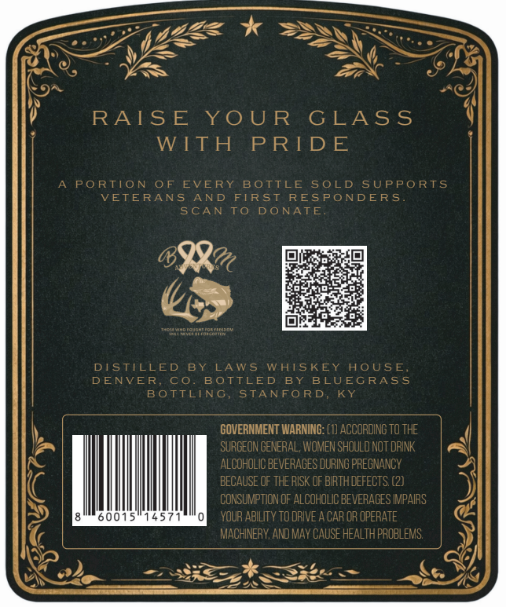
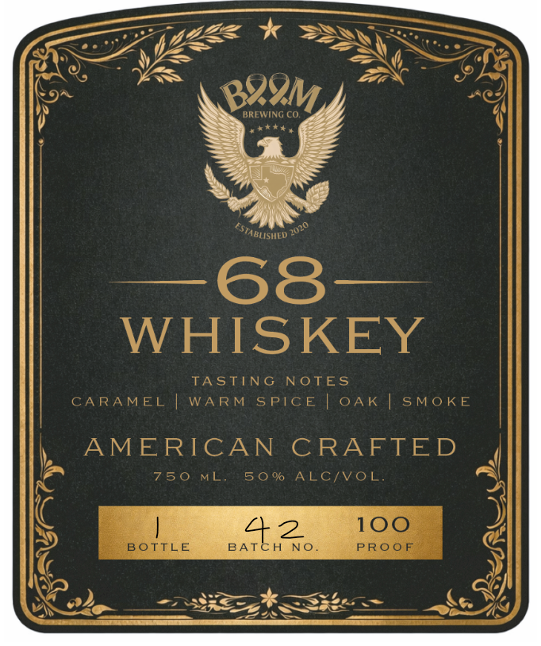

# TTB COLA Label Images - TTBID 26084001000424

**Brand Name:** 68 WHISKEY

**Issue Date:** 04/06/2026

**Origin Code:** 22

**Product Class/Type:** 140

**Source:** [TTB Public COLA Registry](https://ttbonline.gov/colasonline/viewColaDetails.do?action=publicFormDisplay&ttbid=26084001000424)

## Label Images

### Back Label

### Front Label

## Extracted Label Text

*Text extracted via OCR - may contain errors*

**Detected Proof:** 100

### Back Label

RAIS E
YO U R
G LASS
WTTH
PRIDE
PORTIO N
0 F
EVERY
BOTTLE
S0LD SUPPO RTS
VETERANS
AND
FTRST RESPONDER S
SCAN
To
DO NATE
Vougito
DTSTILLED
B Y
LAW5
WATSKEY
AOUsE
DENVER,
C0
BOTTLED
BY
B LUEGRAS5
BoTTLING
STANFORD
KY
GOVERNMENT WARNING: (1] ACCORDING TO THE
SURGEON GENERAL; WOMEN SHOULD NOT DrINK
ALCOHOLIC BEVERAGES DURING PREGNANCY
BECAUSE OF THE RISK OF BIRTHDEFECTS (2)
CONSUMPTION OF ALCOHOLIC BEVERAGES IMPAIRS
YOUR ABILITY tO DRIVE
CAR OR OPERATE
MACHINERY,AnD Mav CAUSE HEALTH PROBLEMS

### Front Label

WHISKEY

TASTING NOTES
CARAMEL | WARM SPICE | OAK | SMOKE

AMERICAN CRAFT

750 ML. 50% ALC/VOL

mi 642
BOTTLE BATCH NO.
