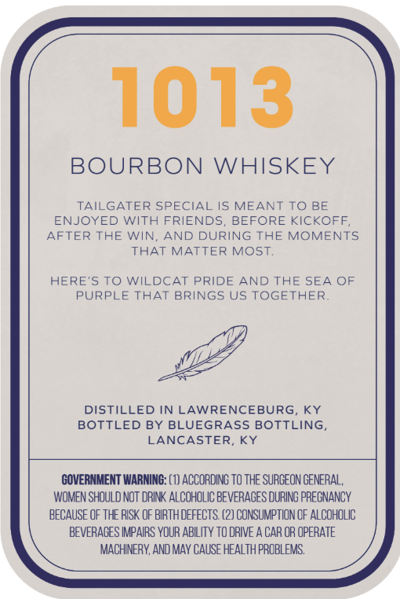
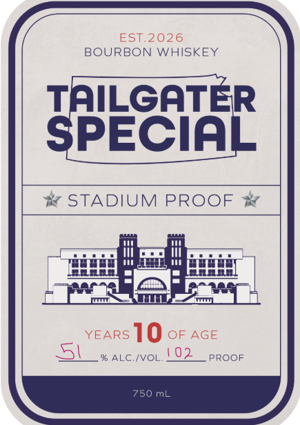

# TTB COLA Label Images - TTBID 26084001000439

**Brand Name:** TAILGATER SPECIAL

**Issue Date:** 04/23/2026

**Origin Code:** 22

**Product Class/Type:** 141

**Source:** [TTB Public COLA Registry](https://ttbonline.gov/colasonline/viewColaDetails.do?action=publicFormDisplay&ttbid=26084001000439)

## Label Images

### Back Label

### Front Label

## Extracted Label Text

*Text extracted via OCR - may contain errors*

### Back Label

1013
BOURBON
WHISKEY
TAILGATER SPECIAL IS MEANT TO BE
ENJOYED WITH FRIENDS
BEFORE KICKOFF ,
AFTER THE WIN
AND DURING THE MOMENTS
THAT MATTER MOST,
HERE'S TO WILDCAT PRIDE AND THE SEA OF
PURPLE THAT BRINGS US TOGETHER
DISTILLED
LAWRENCEBURG, KY
BOTTLED BY BLUEGRASS BOTTLING
LANCASTER,
KY
GOVERNMENT WARNING: (1) ACCORDING To thE SURGEON GENERAL,
Women SHOULD NOT dRINK ALCOHOLIC BeveraGES DURING PRECNANCY
BECAUSE OF THE RISK OF BIRTHDEFECTS: (2) CONSUMPTION €F ALCOHOLIC
BEVERAGES IMPAIRS YOUR ABILITy TO RIE
CAR OR OPERATE
MACHINERY, AND MAY CAUSE HEALTH PROBLEMS.

### Front Label

EST,2026
BOURBON WHISKEY
taILGATER
SPECIAL
STADIUM PROOF
YEARS
10 oF AGE
% ALC /VOL.! 02
PROOF
750 mL
