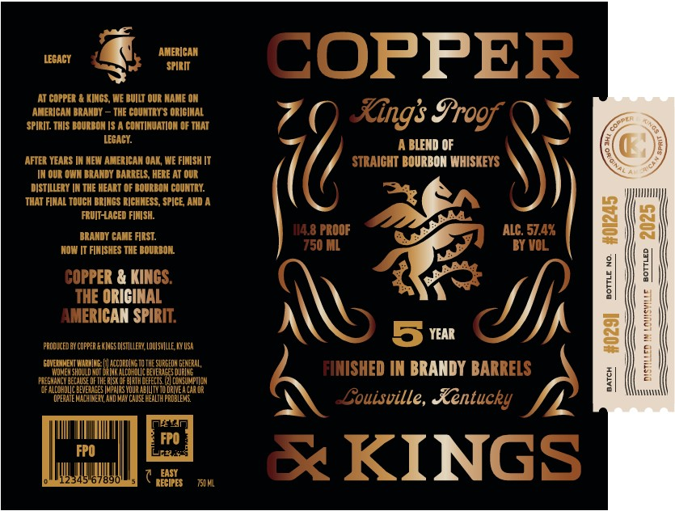

# TTB COLA Label Images - TTBID 26084001000470

**Brand Name:** COPPER & KINGS

**Fanciful Name:** KING'S PROOF

**Issue Date:** 03/25/2026

**Origin Code:** 22

**Product Class/Type:** 121

**Source:** [TTB Public COLA Registry](https://ttbonline.gov/colasonline/viewColaDetails.do?action=publicFormDisplay&ttbid=26084001000470)

## Label Images

### Label 1

## Extracted Label Text

*Text extracted via OCR - may contain errors*

**Detected Proof:** 114.8
**Detected Age:** 5 Years

### Label 1

LEGACY
AEFReA#
COPPER
At COPPER
KINGS , WE BUILT OUR NAME ON
AMERICAN BRANDY _
THE COUNTRY $ ORICIMAL
Xngs Irogf
SPIRIT: THIS DOURBOH I5
CONTIMUATION 0F THAT
LECACY:
BLEND OF
AFTER VEARS
NEW AMERICAN OAK,WE FIAISH [T
STRAICHT BOURBON WHISKEYS
OUL OWN DRANDY DARRELS, HERE AT OUL
DISTILLERY IN THE HEART OF DOUEEON COUNTEY:
THAT FINAL TOUCH BEINCS EICHHESS, SPICE, AND
FRUIT-ACED FIHISH:
114.8 PROOF
ALC. 57.4X
In
BRANDY CAME FIRST:
NOw IT FINISHES THE BOULDOR
'750 ML
BY VOL

COPPER & KINCS.
1
THE ORICINAL
AMERICAN SPIRIT:
1
prODUceD BY copper & @Jngs dIstlllezy LOULsvIlle KY USA
5 year
2
GUVEDNEEJHE
ccnpdI S
JEzreeobErhzbaL;
FINISHED IN BRANDY BARRELS
PEEGHAHCYC
NNSUMPIICN
0
DRIVE A CaR @R
OPERH
HIHEY
ChveeL
PRDBLEMS
~Couisville, Rentucky
Kat
FPO
FPO
2345 67890
EASY
KINGS
RECIPES
75JM
