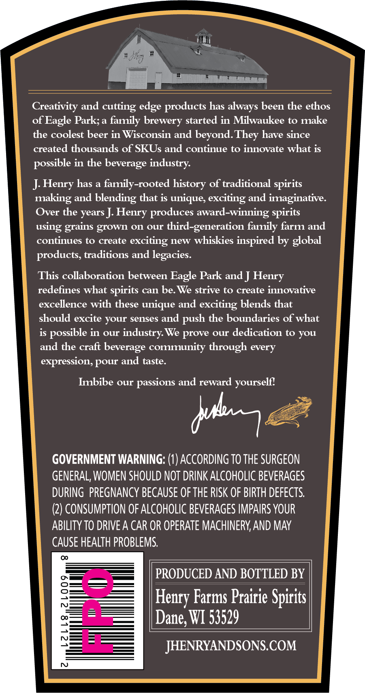
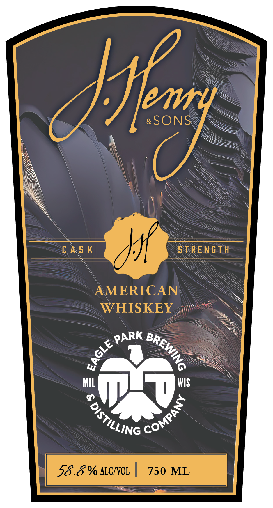

# TTB COLA Label Images - TTBID 26084001000531

**Brand Name:** J. HENRY & SONS

**Issue Date:** 03/26/2026

**Origin Code:** 48

**Product Class/Type:** 140

**Source:** [TTB Public COLA Registry](https://ttbonline.gov/colasonline/viewColaDetails.do?action=publicFormDisplay&ttbid=26084001000531)

## Label Images

### Back Label

### Front Label

### Label 3

## Extracted Label Text

*Text extracted via OCR - may contain errors*

*1 image(s) excluded: text did not meet readability threshold*

**Detected Proof:** 117.6

### Back Label

Creativity and cutting edge products has always been the ethos
of Eagle Park; a family brewery started in Milwaukee to make
the coolest beer in Wisconsin and beyond.
have since
created thousands of SKUs and continue to innovate what is
in the beverage industry:
J:Henry has a family-rooted history of traditional
making and blending that is unique; exciting and imaginative.
Over the years J:
produces award-winning
grains grown On our third-generation
family farm and
continues to create
exciting new whiskies inspired by global
products, traditions and legacies:
This collaboration between Eagle Park and ] Henry
redefines what
can be: We strive to create innovative
excellence with these unique and exciting blends that
should excite your senses and
the boundaries of what
is possible in our industry We
our dedication to you
and the craft beverage community through every
expression, pour and taste.
Imbibe our
passions and reward yourself'
GOVERNMENT WARNING: (1) ACCORDING TO THE SURGEON
GENERAL, WOMEN SHOULD NOT DRINK ALCOHOLIC BEVERAGES
DURING PREGNANCY BECAUSE OF THE RISK OF BIRTH DEFECTS:
(2) CONSUMPTION OF ALCOHOLIC BEVERAGES IMPAIRS YOUR
ABILITY TO DRIVE A CAR OR OPERATE MACHINERY AND MAy
CAUSE HEALTH PROBLEMS.
PRODUCED AND BOTTLED BY
Farms Prairie Spirits |
87
[Dane; WI 53529
JHENRYANDSONS.COM
N
They
possible
spirits
Henry
spirits
using
spirits
push
prove
Aui
Henry

### Front Label

&SONS
c AS K
S TRENG TH
AMERICAN
WHISKEY
MI
WIS
0
58.8% ALCIVOL
750 ML
Affry
PARK
BREWING
3
COMPANY
DiStILLING
