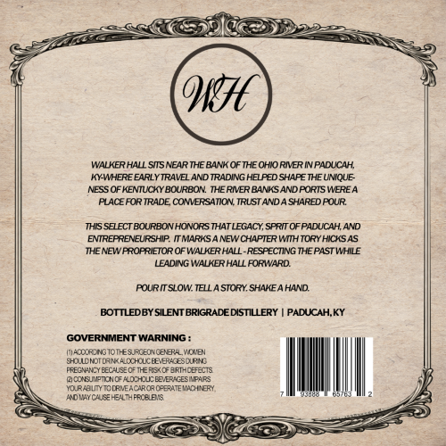
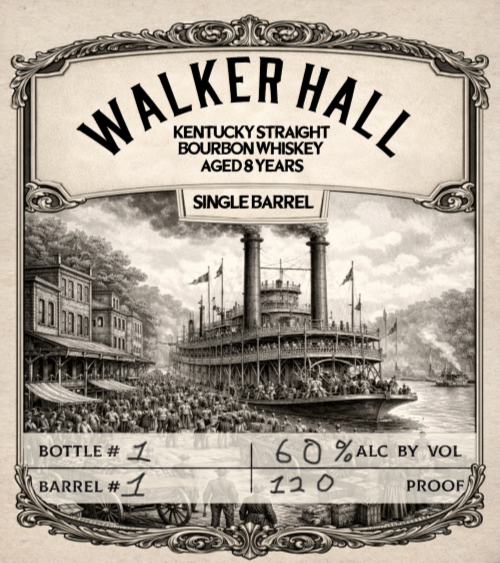

# TTB COLA Label Images - TTBID 26084001000536

**Brand Name:** WALKER HALL KENTUCKY STRAIGHT BOURBON WHISKEY

**Issue Date:** 03/27/2026

**Origin Code:** 22

**Product Class/Type:** 101

**Source:** [TTB Public COLA Registry](https://ttbonline.gov/colasonline/viewColaDetails.do?action=publicFormDisplay&ttbid=26084001000536)

## Label Images

### Back Label

### Front Label

## Extracted Label Text

*Text extracted via OCR - may contain errors*

*1 image(s) excluded: text did not meet readability threshold*

### Back Label

WALKER HALL 5ITS MEAR THE BANK OF THE OHIO RMER INPADUCAH;
KY-WHERE EARLYTRAVEL AND TRADING HELFED SHAFE THE UMIQUE
NESS OF KENUCKY BOURBON THE RIVER BANKS AND PORIS WEREA
PLACE FOR IRADE COMERSAIIOV IRUSI ANDA SHARED POUR
THIS SELECT BOURBONHONORS THAT LEGACY, SPRT OF PADUCAH, AND
ENREPRENEURSHIP TMARKS
NEWCHAPTERWIH TORY HICKSAS
THENEWFROFRIEIOR OF WALKER HALL-RESPECTING THE PAST WHILE
LEADING WALKER HALL FORWARD
ROURITSLOW: TELLA STORY SHAKE AHAND
BOTTLEDBY SILENTBRIGRADE DISTILLERY
PADUCAHKY
GOVERNMENT WARNING
ATnCocecns onESAEO Co EPAvad
SULNOT [AM ALCHOUCEE ERAESAKNC
FreCyoNcFeCHIOTKERs-mferi-metEcTS
MoteiM-hChohoikcodplcosidd
U _emferecop@etds etap
Mo ACAHZAIkFhLRE 3
