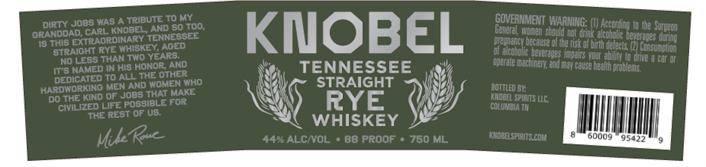

# TTB COLA Label Images - TTBID 26084001000566

**Brand Name:** KNOBEL

**Issue Date:** 03/25/2026

**Origin Code:** 43

**Product Class/Type:** 102

**Source:** [TTB Public COLA Registry](https://ttbonline.gov/colasonline/viewColaDetails.do?action=publicFormDisplay&ttbid=26084001000566)

## Label Images

### Front Label

### Label 2

### Label 3

### Label 4

## Extracted Label Text

*Text extracted via OCR - may contain errors*

*2 image(s) excluded: text did not meet readability threshold*

**Detected Proof:** 88

### Front Label

dirty Jobs WAS Antributrog04Too,
GQVERNMENT WARNNG (V Aceoding I Uhe
GRANDDAD CAordiobey TENN SoSE00
KMOBEL
Reonaneworren Sroule sa dons akohgke Leeraues QuRnn
Is This EGh?A@RDINAISKEENAED
Oredranek berause o8 the nst o1 Drth defects (2] Consumpuon
STOAG,ss RYEANHISRE EARS
Dfealchoke heverades Ugans Your abiny @o DrNE & Gar On
IT"O NASED IAhis honortAnd
TENNESSEE
qperarte machnzry end may Cause healh Droblems,
DEDICATED To ALL The othER
HARDIVORKING MEN AND VOMEMKHO
STRAIGHT
Bottled BY:
DOUTHE KIND OffJobssibLE FORKE
RYE
KMOBEL SPIRnS LLC;
'CIvILIZED Life POSSiBLE
CoLUMBIA TM
THE REST OF Us.
WHISKEY
MkkR
44% ALCIVOL
88 Proof
750 ML
KnobeLSpIRITS Col
60009
95422
9
Surgeon

### Label 4

Work HARD
HANDCRAFTED
PLAY FAIR
SMALL BATCH
BE KNOBEL
