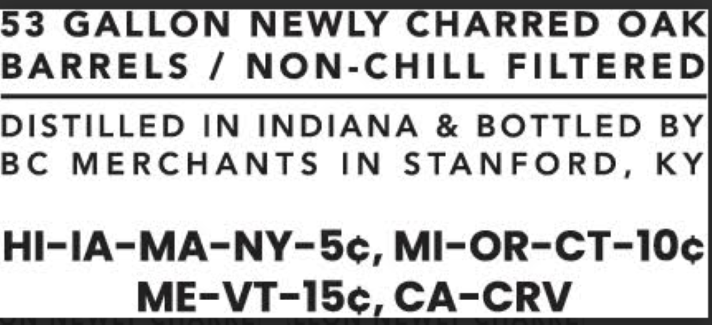
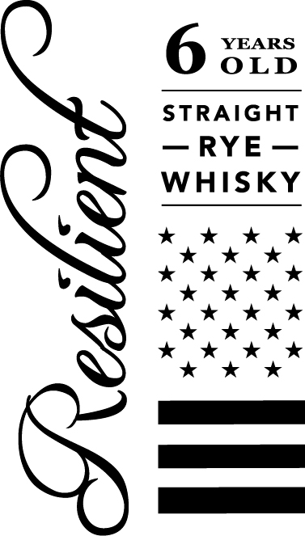
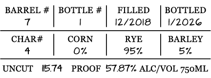
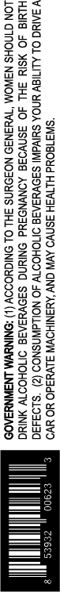

# TTB COLA Label Images - TTBID 26084001000569

**Brand Name:** RESILIENT

**Issue Date:** 03/25/2026

**Origin Code:** 22

**Product Class/Type:** 102

**Source:** [TTB Public COLA Registry](https://ttbonline.gov/colasonline/viewColaDetails.do?action=publicFormDisplay&ttbid=26084001000569)

## Label Images

### Back Label

### Front Label

### Label 2

### Label 3

## Extracted Label Text

*Text extracted via OCR - may contain errors*

*1 image(s) excluded: text did not meet readability threshold*

**Detected Proof:** 115.7

### Back Label

53
GALLON
NEWLY CHARRED
OAK
BARRELS
1
NON-CHILL
FILTEREDI
DISTILLED
IN
INDIANA
&
BOTTLED
BY
BC
MERCHANTS
IN
STANFORD,
KY
HI-IA-MA-NY-Sc, MI-OR-CT-IOc]
ME-VT-JbCA-CRV

### Label 2

BARREL # | BOTTLE #| FILLED | BOTTLED
7 | 12/2018 | 1/2026
CHAR# CORN RYE BARLEY
4 On 95%. 5%
UNCUT 15.74 PROOF 57.87% ALC/VOL 750ML

### Label 3

“SWITEOUd HITW3H SSNVO AV CNV ‘AYSNIHOWW SLV4adO YO YVO
V SAIC OL ALITIBY HNOA SHIVdI\I S3OVY3AIA DIIOHOOW 40 NOLLAWNSNOO (2) ‘s193430
Hiwia 4O ¥SIY 3HL JO 3SNVOIG AONVNOTYd ONRUNG SIOvYSAIS OMOHOOTY MNING
LON GINOHS NAWOM “WH3N39 NOFONNS FHL OL ONIGHODOY (1) :ONINYWM LNSWNYSA0S
