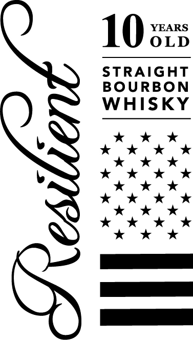
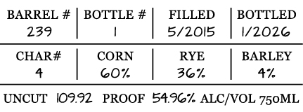
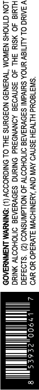

# TTB COLA Label Images - TTBID 26084001000571

**Brand Name:** RESILIENT

**Issue Date:** 03/25/2026

**Origin Code:** 22

**Product Class/Type:** 101

**Source:** [TTB Public COLA Registry](https://ttbonline.gov/colasonline/viewColaDetails.do?action=publicFormDisplay&ttbid=26084001000571)

## Label Images

### Back Label

### Front Label

### Label 2

### Label 3

## Extracted Label Text

*Text extracted via OCR - may contain errors*

**Detected Proof:** 72

### Back Label

53
GALLON
NEWLY CHARRED
OAK
BARRELS
1
NON-CHILL
FILTEREDI
DISTILLED
IN
INDIANA
&
BOTTLED
BY
BC
MERCHANTS
IN
STANFORD,
KY
HI-IA-MA-NY-Sc, MI-OR-CT-IOc]
ME-VT-JbCA-CRV

### Front Label

10 zs
OLD
STRAIGHT
BOURBON

WHISKY

v kk
kok kk

kkk

b kok wk &
kkk

kk kk

kk *

kok kk

kk Ok
Pe
a
Pe

### Label 2

BARREL #

BOTTLE #

FILLED

BOTTLED

239

|

!

|

5/2015

|

1/2026

CHAR#

CORN

RYE

BARLEY

4

|

GOw

|

36%

|

4%

UNCUT 109.92 PROOF 54.96% ALC/VOL 750ML

### Label 3

‘SN3T8OUd HLTV3H SSNVO AVIV CNV ‘ANANIHOWI Wud YO VO
V SANG OL ALITISY UNDA SUIVdINI SSOVYIATA OMOHODTY 4O NOLLdWNSNOD (2) ’S193430
HLMI8 JO YSIM SHL 40 3SNVO3E AONVNOSYd ONIN S3OVYIATS OMOHOOTW YNING
LON CINOHS N3WOM “TWH3N39 NOFOUNS FHL OL ONIGHODOY (1) :ONINUWM LNSINNYGAOD
