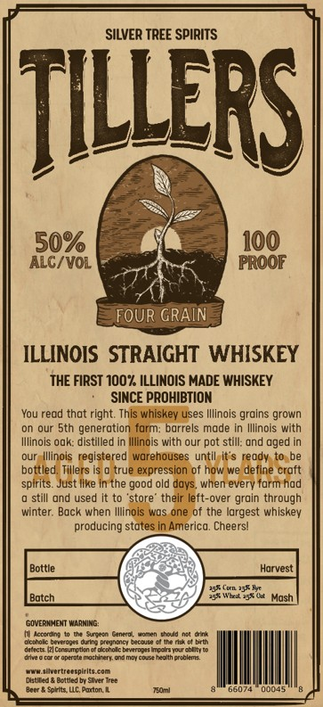
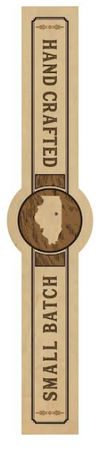

# TTB COLA Label Images - TTBID 26084001000613

**Brand Name:** TILLERS

**Issue Date:** 03/31/2026

**Origin Code:** 04

**Product Class/Type:** 100

**Source:** [TTB Public COLA Registry](https://ttbonline.gov/colasonline/viewColaDetails.do?action=publicFormDisplay&ttbid=26084001000613)

## Label Images

### Front Label

### Label 2

## Extracted Label Text

*Text extracted via OCR - may contain errors*

*1 image(s) excluded: text did not meet readability threshold*

**Detected Proof:** 100

### Front Label

SILVER TREE SPIRITS
TlluerS
50%
100
ALC/ VOL
PROOF
FOUR GRAIN
ILLINOIS STRAIGHT WHISKEY
THE FIRST 100% ILLINOIS MADE WHISKEY
SINCE PROHIBTION
You read that right. This whiskey uses Illinois grains grown
on our Sth generation farm: barrels made In Illinois with
Illinois oak: distilled in Illinois with our
still: ond oged in
our Illinois registered warehouses until
eady
bottled
Tillers is
true expression of how we define craft
spirits. Just Iike in the good old days. when every farm had
still and used it to 'store
their left-over groin through
winter. Back when Illinois wos one of the largest whiskey
producing states In America; Cheersl
Bottle
Harvest
752' Dn
Botch
15* WVE
36
Mash
goverhHeNt Warning:
LCGCtn=
te
enarn
Meena
bauronri duina 0icyna1gi (4691#
Ihe ra 0 &t
dutrcthIcoalnetenot ortolc brtroau mmacnwrcbllty ED
{omaicicorotinnodin
ondmaicoraneo thereckma
Anunftnennnntcor
nkellede Reuiledibeslker Tree
Anlntrae dotonaM
Tonl
Ee
dlLS
pot =
