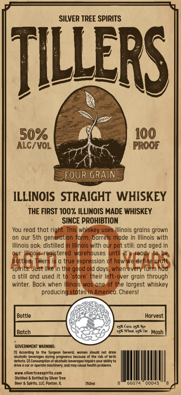

# TTB COLA Label Images - TTBID 26084001000618

**Brand Name:** TILLERS

**Issue Date:** 03/26/2026

**Origin Code:** 04

**Product Class/Type:** 100

**Source:** [TTB Public COLA Registry](https://ttbonline.gov/colasonline/viewColaDetails.do?action=publicFormDisplay&ttbid=26084001000618)

## Label Images

### Label 1

### Label 2

## Extracted Label Text

*Text extracted via OCR - may contain errors*

*1 image(s) excluded: text did not meet readability threshold*

**Detected Proof:** 100

### Label 1

SILVER TREE SPIRITS
TiLLeRSL
50%
100
Alc/VOL
PROOF
FOUR GRAIN
ILLINOIS STRAIGHT WHISKEY
THE FIRST 100%. ILLINOIS MADE WHISKEY
SINCE PROHIBTION
You read that right: This whisker
uses
Illinois grains grown
on our Sth generation form; barrels made in Illinois with
Illinois oak; distilled
Inois with our pot still; and oged
Illinois registered warehouses until
ready
Illers Ist
true expression of how -
we defie
rott
spttiedJ
Just Iike in the good old
when every farm hod
still and used it to 'store'
their left-over grain through
winter: Back when Illinois was one of the largest whiskey
producing states In America Cheersl
Bottle
Horvest
Gten E50et
Botch
358 Wtn
Mosh
GOVLRNMENT Warwing:
Arrdra
Sutheei
Mnate|
Katene
Einan
TDar o4ka Detanty brcoue otecht Te4 0 Grt
cefectr [2| Censungtan of dcchoic baveroges Imeatypof obuty t
Erle 0 cor 0r oeemke mechneruidumay cuneFeoah preb ents
ullertrettpinte com
natlede
Bottkdbr Slher (net
Bacr & Sorltz C Fexton L
66074
00045
dovs:
d
