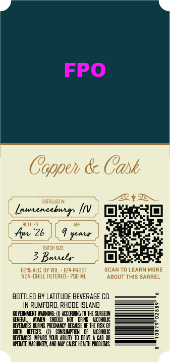
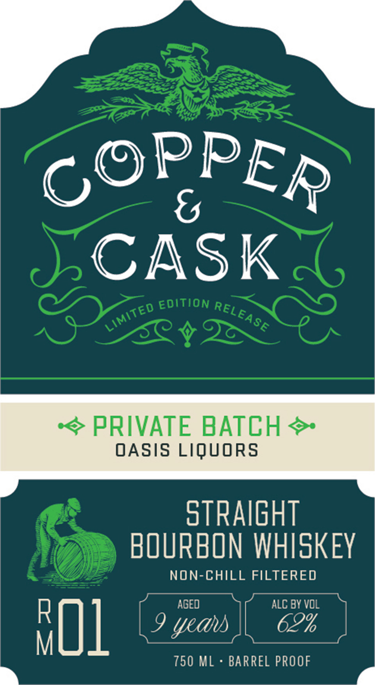

# TTB COLA Label Images - TTBID 26084001000632

**Brand Name:** COPPER & CASK

**Issue Date:** 03/26/2026

**Origin Code:** 40

**Product Class/Type:** 101

**Source:** [TTB Public COLA Registry](https://ttbonline.gov/colasonline/viewColaDetails.do?action=publicFormDisplay&ttbid=26084001000632)

## Label Images

### Back Label

### Front Label

### Label 3

## Extracted Label Text

*Text extracted via OCR - may contain errors*

**Detected Proof:** 124

### Back Label

FPO
Coppeh & Cask
QistlLed IN
40+2
Labencebuir
DiZXL
bottled
Apv "2b
#eai
BXTCH SIZE
Battel
629 ALC; BY VOL
124 prOOF
SCANTO LEARN MORE
NON-CHILL FILTERED - 750 ML
ABOUT ThIS BARREL
bCTtLed BY LatItuDE BEVERAGE Co.
RuMFORD, RHODE ISLAND
GQHERMMENT
LRNINE:
@li
HOCCADIMG TO THE  SURGECH
GENERLL
DRINK
NC_HOLIC
BEVERME
D
FAEGNNY DECWGE QF THE RLI OF
DEFECIS
CoNQumptIC
oF _ NCoHOlIC
BEVERAGES IPVRS YQUR
TEM=
CAR OR
OPERATE HLCHINERY
CNKE
PROBLBXS

### Front Label

6
CASK
EDITION
PRIVATE BATCH &
OASIS LIQUORS
stRaIgHT
BOURBON WHISKEY
NON-CHILL FILTERED
AGED
ALC BY VOL
BO1
9 yedus
62%
750 ML
BARREL PROOF
PPER
C(
RELEASE
LIMITED

### Label 3

COPPER & CASK Say

MSW 8 WdddOd

a=
