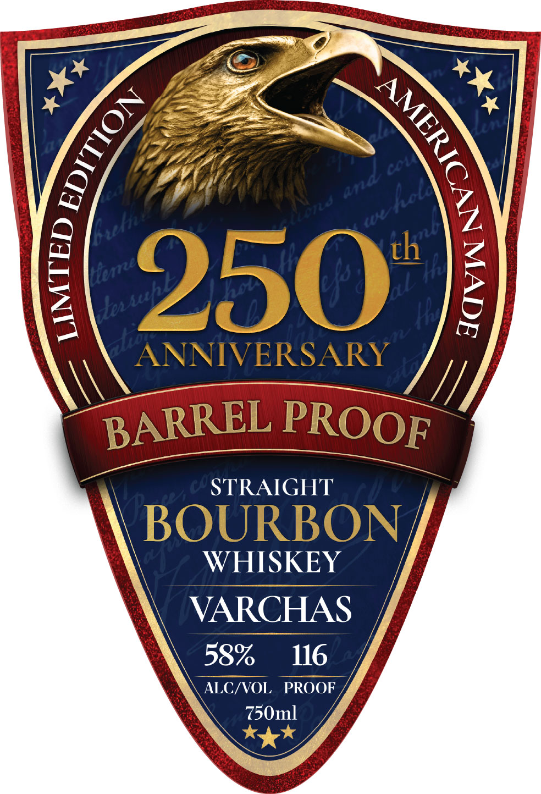
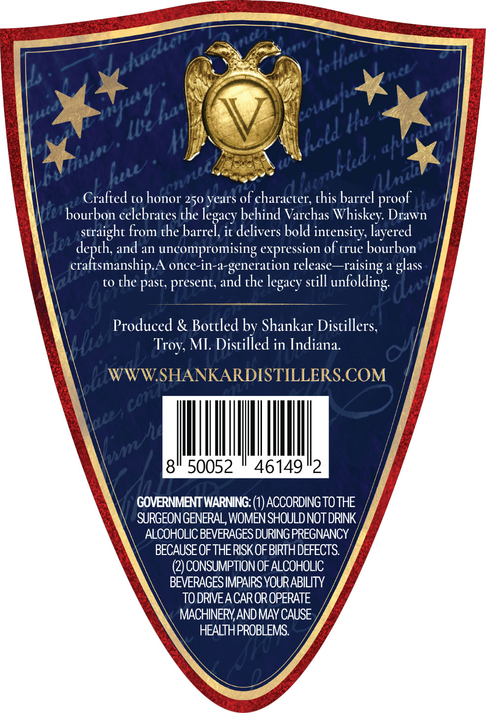

# TTB COLA Label Images - TTBID 26084001000667

**Brand Name:** VARCHAS

**Fanciful Name:** 250TH ANNIVERSARY

**Issue Date:** 03/26/2026

**Origin Code:** 06

**Product Class/Type:** 101

**Source:** [TTB Public COLA Registry](https://ttbonline.gov/colasonline/viewColaDetails.do?action=publicFormDisplay&ttbid=26084001000667)

## Label Images

### Label 1

### Label 2

## Extracted Label Text

*Text extracted via OCR - may contain errors*

**Detected Proof:** 116

### Label 1

W
th
0
on
250
Hu
ANNIVERSARY
STRAIGHT
BOURBON
WHISKEY
VARCHAS
58%
116
ALC/VOL
PROOF
750ml
)
[
CA
nd
fucl
3
A
Buh
Here
AL
A
7244
BARREL
PROOF

### Label 2

KcHutt
I0
fut
Hw
aft
hww
Crafted to honor 250 years of character; this barrel
Iebourbon celebrates the
behind Varchas Whiskey Drawn
straight from the barrel, it delivers bold intensity layered
Uo depth and
an
uncompromising expression of true bourbon
craltsmanship A once-in-a-generation release-raising a glass
to
the past, present, and the
still
(w|
nVl"t
Produced & Bottled by Shankar Distillers,
Troy; MI Distilled in Indiana:
WWWSHANKARDISTILLERSCOM
K
8
50052
46149
2
GOVERNMENTWARNING: (1) ACCORDING TO THE
SURGEON GENERAL; WOMEN SHOULD NOT DRINK
ALCOHOLIC BEVERAGES DURING PREGNANCY
BECAUSEOF THERISKOF BIRTH DEFECTS
(2) CONSUMPTION OF ALCOHOLIC
BEVERAGESIMPAIRS YOURABILITY
TO DRIVEACAR OR OPERATE
MACHINERV ANDMAY CAUSE
HEALTHPROBLEMS
shehon
t
Ieousf
IUe
Khold <
cambled ,
Ois
AUnul
proof
legacy
unfolding
legacy
Leisa
Cot
lce,
