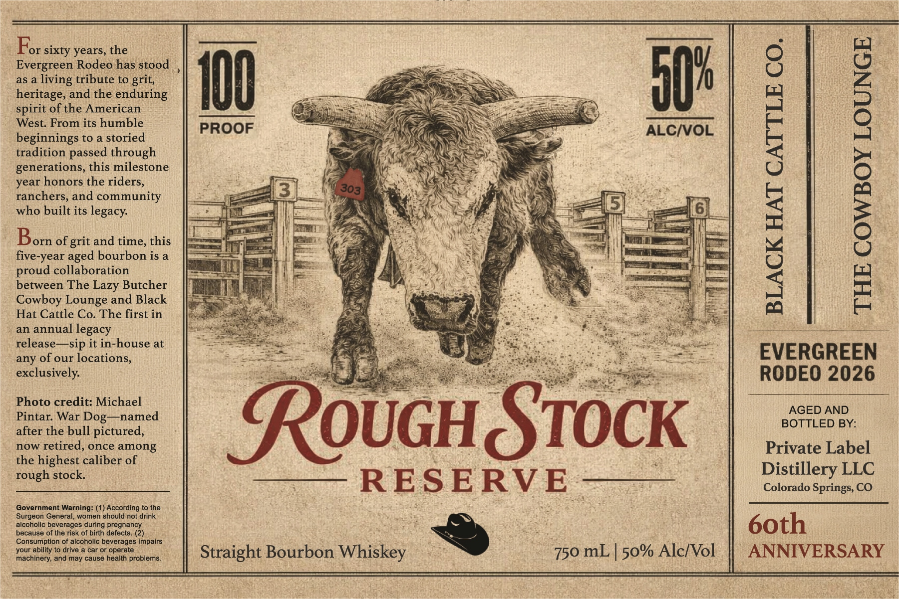

# TTB COLA Label Images - TTBID 26085001000106

**Brand Name:** ROUGH STOCK

**Issue Date:** 03/26/2026

**Origin Code:** 13

**Product Class/Type:** 101

**Source:** [TTB Public COLA Registry](https://ttbonline.gov/colasonline/viewColaDetails.do?action=publicFormDisplay&ttbid=26085001000106)

## Label Images

### Front Label

## Extracted Label Text

*Text extracted via OCR - may contain errors*

**Detected Proof:** 100

### Front Label

Pon sixty years, the
Evergreen Rodeo has stood ,
as a living tribute to grit,
heritage, and the enduring
spirit of the American
West. From its humble
beginnings to a storied
tradition passed through
generations, this milestone
year honors the riders,
ranchers, and community
who built its legacy.

it

ALC/VOL

Born of grit and time, this
five-year aged bourbon is a
proud collaboration
between The Lazy Butcher
Cowboy Lounge and Black
Hat Cattle Co. The first in
an annual legacy
release—sip it in-house at
any of our locations,

THE COWBOY LOUNGE

BLACK HAT CATTLE CO.

EVERGREEN

exclusively. RODEO 2026
Photo credit: Michael

Pintar. War Dog—named Rises fay
after the bull pictured, i
now retired, once among Private Label
the highest caliber of aici

Pen Siok Distillery LLC

Colorado Springs, CO

60th
ANNIVERSARY

—— RESERVE ——

Straight Bourbon Whiskey )

Government Warning: (1) According to the
Surgeon General, women should not drink
alcoholic beverages during pregnancy
because of the risk of birth defects, (2)
Consumption of alcoholic beverages impairs
your ability to drive a car or operate
machinery, and may cause health problems.

750 mL | 50% Alc/Vol
