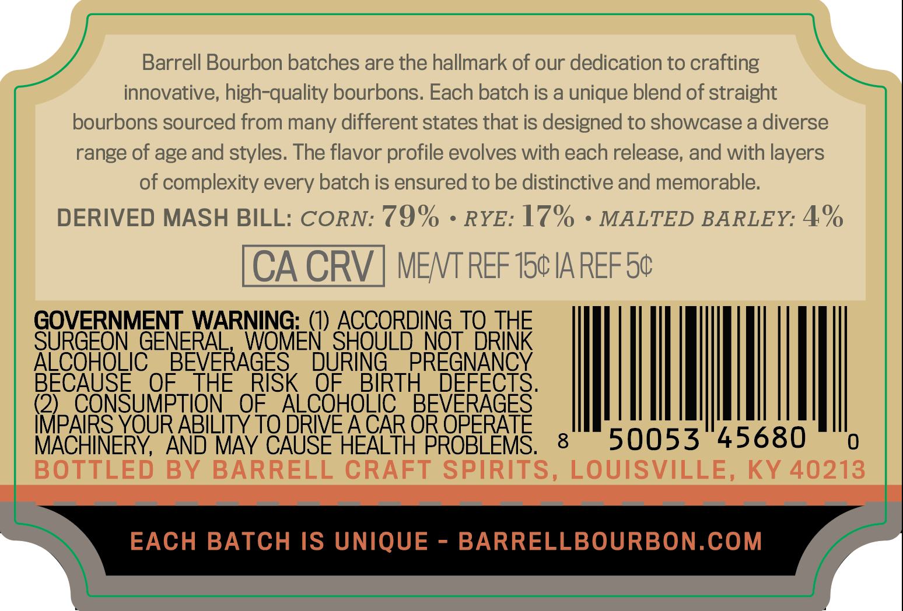
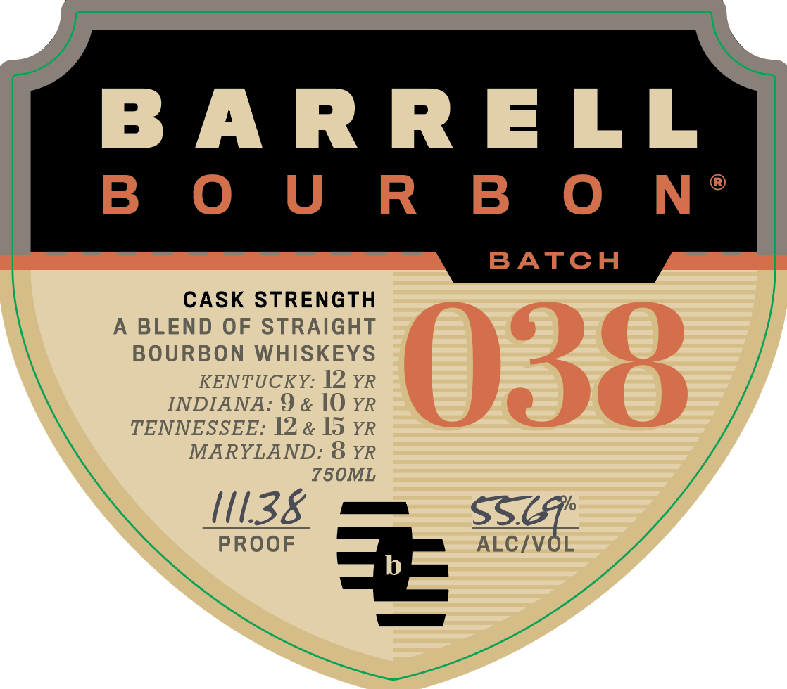

# TTB COLA Label Images - TTBID 26085001000197

**Brand Name:** BARRELL BOURBON

**Issue Date:** 03/26/2026

**Origin Code:** 22

**Product Class/Type:** 121

**Source:** [TTB Public COLA Registry](https://ttbonline.gov/colasonline/viewColaDetails.do?action=publicFormDisplay&ttbid=26085001000197)

## Label Images

### Back Label

### Front Label

### Label 3

## Extracted Label Text

*Text extracted via OCR - may contain errors*

*2 image(s) excluded: text did not meet readability threshold*

### Back Label

Barrell Bourbon batches are the hallmark of our dedication to crafting
innovative, high-quality bourbons. Each batch is a unique blend of straight
bourbons sourced from many different states that is designed to showcase a diverse
range of age and stvles: The flavor profile evolves with each release, and with layers
of complexity every batch is ensured to be distinctive and memorable:
DERIVED MASH BILL: CORN: 79%
RYE: 17%
MALTED BARLEY: 4%
CACRV
MENT REF 154 IA REF 5c
GOVERNMENT WARNING: (I) ACCORDING
JSRTNE
SURGEON GENERAL
WOMEN' SHOULD NOT"
ALCOHOLIC
BEVERAGES
DURING
PREGNANCY
BECAUSE
OF
THE
RISK
OF
BIRTH
DEFECTS.
(2)
CONSUMPTION
OF
ALCOHOLIC
BEVERAGES
IMPAIRS YOUR ABILITY TO DRIE ACAR OR OPERATE
MACHINERY,
AND MAY CAUSE HEALTH PROBLEMS.
8
50053
45680
BOTTLED
BY
BARRELL CRAFT SPIRITS, LOUISVILLE,
KY 40213
EACH BATCH IS UNIQUE
BARRELLBOURBON.COM
