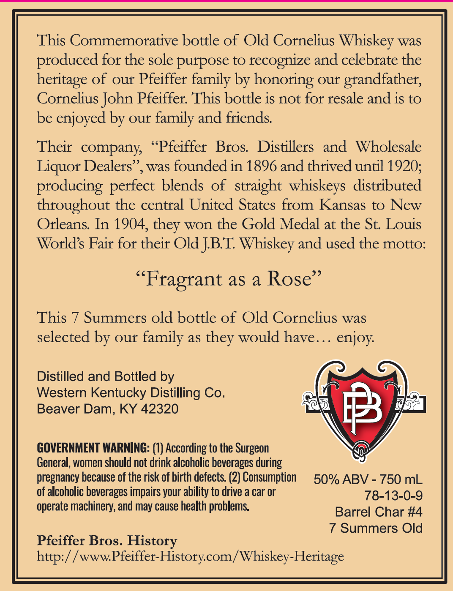

# TTB COLA Label Images - TTBID 26085001000288

**Brand Name:** OLD CORNELIUS SELECT

**Fanciful Name:** KENTUCKY STRAIGHT BOURBON WHISKEY

**Issue Date:** 04/07/2026

**Origin Code:** 22

**Product Class/Type:** 101

**Source:** [TTB Public COLA Registry](https://ttbonline.gov/colasonline/viewColaDetails.do?action=publicFormDisplay&ttbid=26085001000288)

## Label Images

### Back Label

## Extracted Label Text

*Text extracted via OCR - may contain errors*

### Back Label

This Commemorative bottle of Old Cornelius Whiskey was
produced for the sole purpose to recognize and celebrate the
heritage of our Pfeiffer family by honoring our grandfather;
Cornelius John Pfeiffer: This bottle is not for resale and is to
be enjoyed by our family and friends
Their   company    Pfeiffer
Bros   Distillers
and
Wholesale
Liquor Dealers'
was founded in 1896 and thrived until 1920,;
producing perfect blends of  straight whiskeys  distributed
throughout the central United States from Kansas to New
Orleans In 1904,
won the Gold Medal at the St: Louis
Worlds Fair for their Old JBT Whiskey and used the motto:
Fragrant as a Rose
This
Summers old bottle of Old Cornelius was
selected by our
as
would have.
enjoy:
Distilled and Bottled by
Western Kentucky Distilling Co.
Beaver Dam, KY 42320
E
GOVERNMENT WARNING: (1) According to the Surgeon
General; women should not drink alcoholic beverages during
pregnancy because of the risk of birth defects: (2) Consumption
50% ABV
750 mL
of alcoholic beverages impairs your ability to drive a car or
78-13-0-9
operate machinery, and may cause health problems
Barrel Char #4
7 Summers Old
Pfeiffer Bros. History
'wwwPfeiffer-Historycom/ Whiskey-Heritage
they
family
they
http: /
