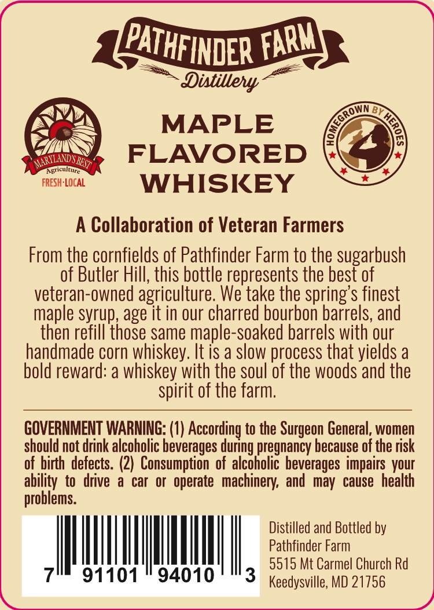

# TTB COLA Label Images - TTBID 26085001000297

**Brand Name:** PATHFINDER FARM

**Issue Date:** 03/26/2026

**Origin Code:** 25

**Product Class/Type:** 149

**Source:** [TTB Public COLA Registry](https://ttbonline.gov/colasonline/viewColaDetails.do?action=publicFormDisplay&ttbid=26085001000297)

## Label Images

### Front Label

## Extracted Label Text

*Text extracted via OCR - may contain errors*

### Front Label

Dixtillely
BP
MAPLE
MAR TowdSBES7
FLAVORED
Agriculture
FRESH:LOCAL
WHISKEY
4
Collaboration of Veteran Farmers
From the cornfields of Pathfinder Farm to the sugarbush
of Butler Hill, this bottle represents the best of
veteran-owned agriculture; We take the spring' s finest
maple syrup; age it in our charred bourbon barrels, and
then refill those same maple-soaked barrels with our
handmade corn whiskey: It is a slow process that yields a
bold reward: a whiskey with the soul of the woods and the
spirit of the farm.
GOVERNMENT WARNING: (0) According to the Surgeon General, women
should not drink alcoholic beverages during pregnancy because of the risk
of_birth defects. (2)   Consumption  of alcoholic beverages impairs vour
ability to   drive
car
Or
operate   machinery; and  may  cause  health
problems.
Distilled and Bottled by
Pathfinder Farm
5515 Mt Carmel Church Rd
91101
94010
3
Keedysville; MD 21756
PATHFINDER
FARM
CGROWN
8
