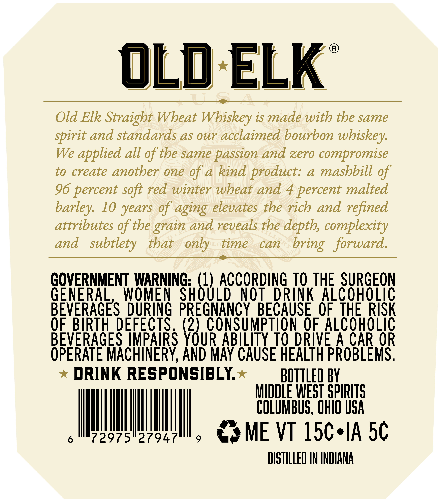
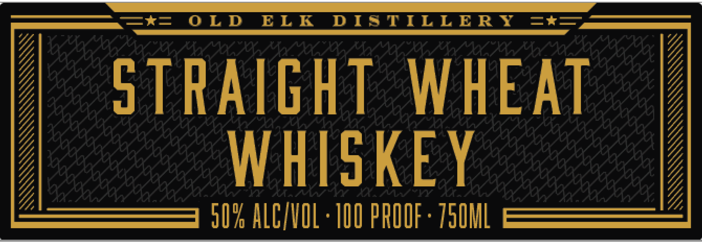

# TTB COLA Label Images - TTBID 26085001000320

**Brand Name:** OLD ELK

**Issue Date:** 04/08/2026

**Origin Code:** 09

**Product Class/Type:** 109

**Source:** [TTB Public COLA Registry](https://ttbonline.gov/colasonline/viewColaDetails.do?action=publicFormDisplay&ttbid=26085001000320)

## Label Images

### Back Label

### Front Label

### Label 3

## Extracted Label Text

*Text extracted via OCR - may contain errors*

*1 image(s) excluded: text did not meet readability threshold*

**Detected Proof:** 100
**Detected Age:** 10 Years

### Back Label

Old ELK
9
Old Elk Straight Wheat Wbiskey is made with the same
spirit and standards as our acclaimed bourbon
wbiskey:
We
applied all of the same passion and zero compromise
to create another one of a kind product:
4
mashbill of
96 percent soft red winter wheat and
4
percent malted
10 years of aging elevates tbe rich and refined
attributes of the
and reveals the depth, complexity
and
subtlety
that
only _time
can
bring   forward.
GOVERNMENT WARNING: (1) ACCORdinG TO THE SURGEON
GENERAL,
WOMEN
SHOULD
NOT
DRINK Alcoholic
BEVERAGES DURING PREGNANCY BECAUSE_OF THERISK
0F.BIRTH DEFECTS . (2), CONSUMPTHON OF AlcoHoLIC
BEVERAGES IMPAIRS YOUR ABILITY TO DRIVE A CAR OR
OPERATE MACHINERY, AND MAY CAUSE HEALTH PROBLEMS ,
DRINK RESPONSIBLY
bOTTLeD bV
MIDDLE WEST SPIRITS
COLUMBUS, OHIO USA
72975"27947
9
ME VT 15c-IA 5c
DISTHLLED IN INDIANA
barley:
grain

### Front Label

Zt=
0 LD
ELE
DI9TILLERT
2t3
sTRAight
WHEAT
WHISkEY
50% ALCZVOL ' IIO PRIIF . Z5IML
