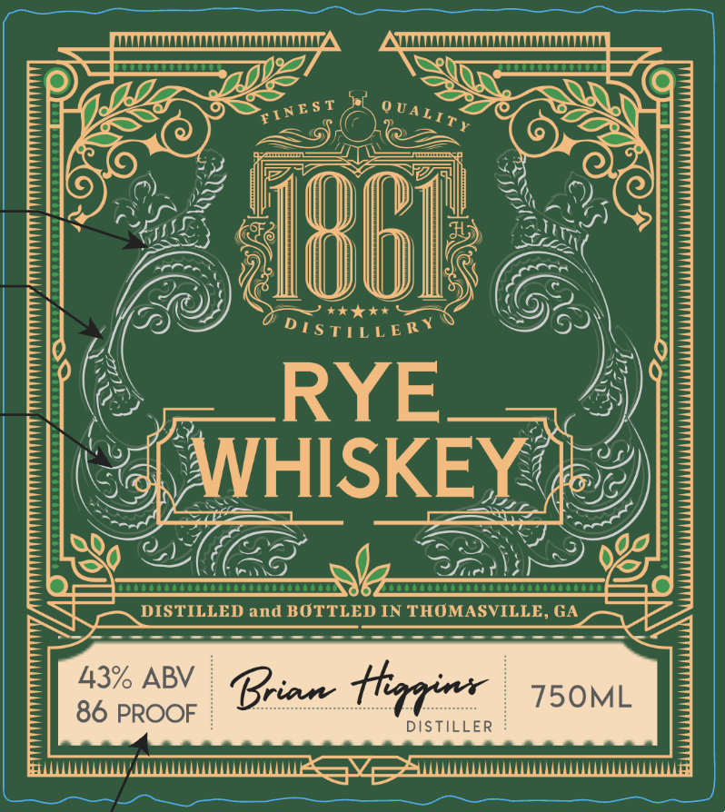
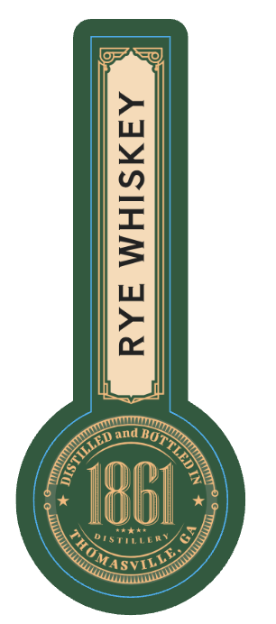
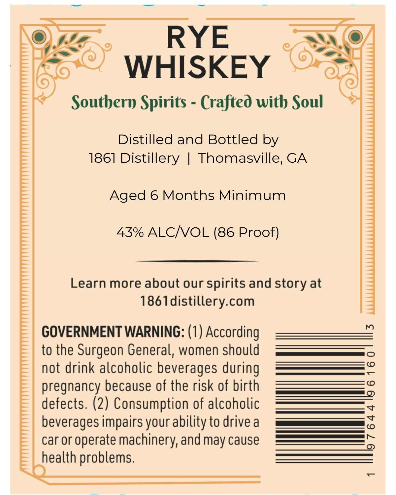

# TTB COLA Label Images - TTBID 26085001000363

**Brand Name:** 1861 DISTILLERY

**Fanciful Name:** RYE WHISKEY

**Issue Date:** 03/31/2026

**Origin Code:** 08

**Product Class/Type:** 142

**Source:** [TTB Public COLA Registry](https://ttbonline.gov/colasonline/viewColaDetails.do?action=publicFormDisplay&ttbid=26085001000363)

## Label Images

### Front Label

### Label 2

### Label 3

## Extracted Label Text

*Text extracted via OCR - may contain errors*

*1 image(s) excluded: text did not meet readability threshold*

**Detected Proof:** 86

### Front Label

D[ S TILLE R Y
RYE
WHISKEY
DISTILLED and BOTTLED IN THOMASVILLE, GA
43% ABV
Bian tnrr
75OML
86 PROOF
DISTILLER
ST
0 UALIE
INE
096

### Label 3

RYE
WHISKEY
Southern Spirits
Crafted with Soul
Distilled and Bottled by
1861 Distillery
Thomasville, GA
Aged 6 Months Minimum
43% ALCNOL (86 Proof)
Learn more about our
spirits and
at
1861distillery com
GOVERNMENT WARNING: (1) According
m
to the Surgeon General, women should
0
not drink alcoholic beverages during
c
pregnancy because of the risk of birth
(0
2
defects. (2) Consumption of alcoholic
beverages impairs your ability to drive a
3
car Or
operate machinery; and may cause
5
health problems.
story
