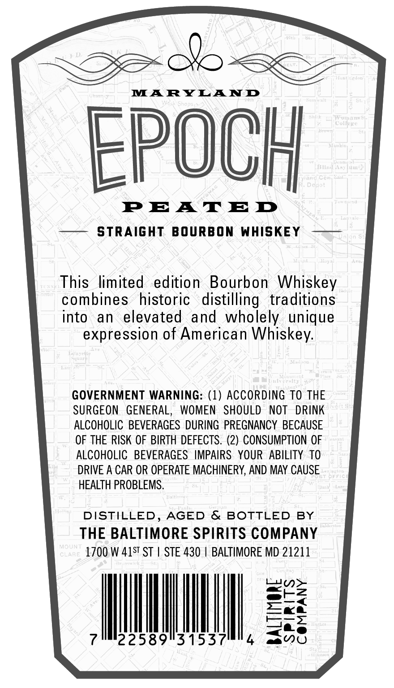
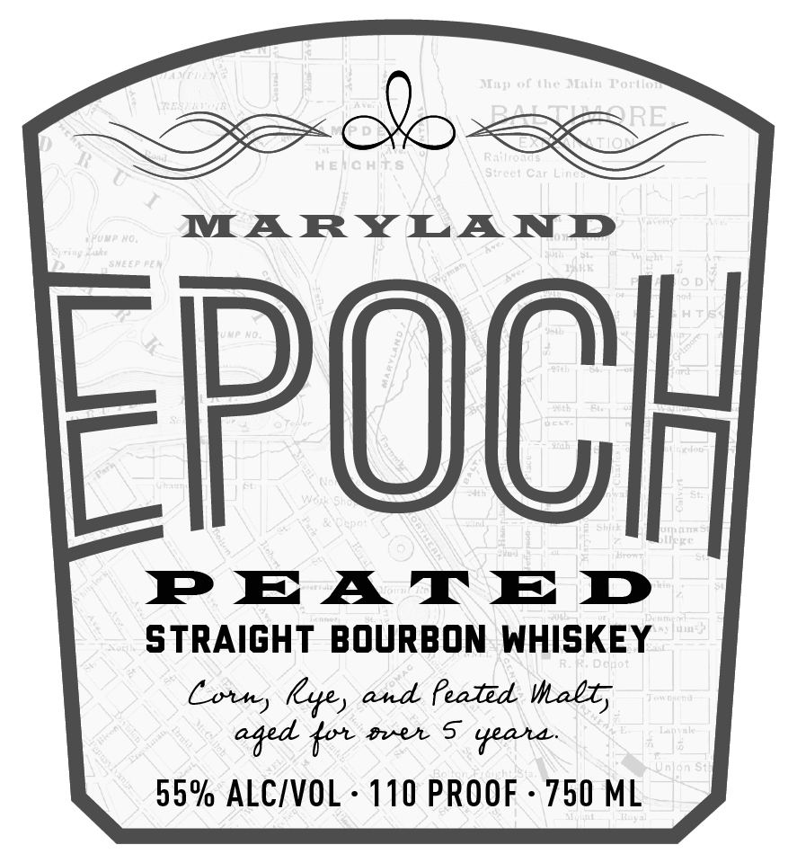

# TTB COLA Label Images - TTBID 26085001000396

**Brand Name:** EPOCH

**Issue Date:** 03/26/2026

**Origin Code:** 25

**Product Class/Type:** 101

**Source:** [TTB Public COLA Registry](https://ttbonline.gov/colasonline/viewColaDetails.do?action=publicFormDisplay&ttbid=26085001000396)

## Label Images

### Back Label

### Front Label

### Label 3

## Extracted Label Text

*Text extracted via OCR - may contain errors*

*1 image(s) excluded: text did not meet readability threshold*

**Detected Proof:** 110

### Back Label

MARYLAND
5nCUJ
Wvinn j
Collrk (
FpOCH
Qp o
P EA TED
STRAIGHT
BOURBON WHISKEY
This   limited
edition
Bourbon Whiskey
combines
historic   distilling   traditions
into
an
elevated
and wholely unique
expression of American Whiskey:
Ji|3t ("
GOVERNMENT WARNING: (1) ACCORDING TO THE
SURGEON
GENERAL,
WOMEN   SHOULD
NOT
DRINK
ALCOHOLIC BEVERAGES DURING  PREGNANCY  BECAUSE
OF THE RISK OF BIRTH DEFECTS. (2) CONSUMPTION OF
ALCOHOLIC  BEVERAGES  IMPAIRS   YOUR ABILITY TO
DRIVE A CAR OR OPERATE MACHINERY, AND MAY CAUSE
DfF C
HEALTH PROBLEMS.
DISTILLED, AGED
& BOTTLED
BY
THE BALTIMORE SPIRITS COMPANY
MOUT
CARE
1700 W 41ST ST
STE 430
BALTIMORE MD 21211
22589131537-

### Front Label

Seb ser

MARY LAN D

EPOCH

PEATE DD
STRAIGHT BOURBON WHISKEY
Corn, Lye, and feated Malt,
aged for over S yeara
55% ALC/VOL- 110 PROOF - 750 ML
