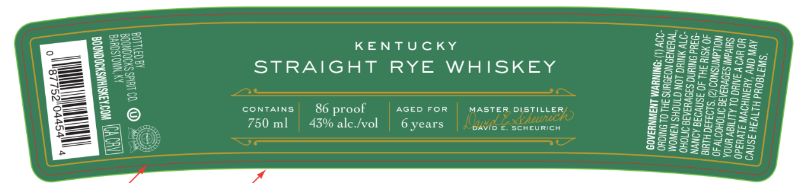
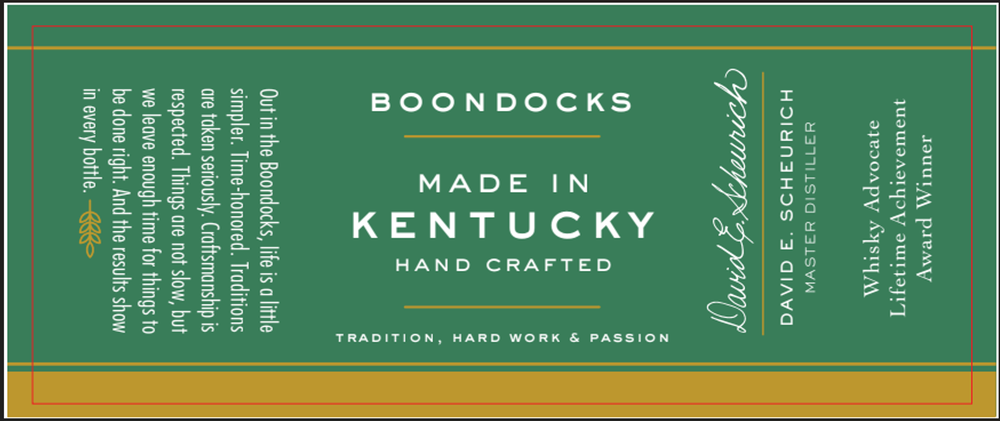

# TTB COLA Label Images - TTBID 26085001000417

**Brand Name:** BOONDOCKS

**Fanciful Name:** KENTUCKY STRAIGHT RYE WHISKEY

**Issue Date:** 03/26/2026

**Origin Code:** 22

**Product Class/Type:** 102

**Source:** [TTB Public COLA Registry](https://ttbonline.gov/colasonline/viewColaDetails.do?action=publicFormDisplay&ttbid=26085001000417)

## Label Images

### Front Label

### Label 2

## Extracted Label Text

*Text extracted via OCR - may contain errors*

*1 image(s) excluded: text did not meet readability threshold*

### Label 2

JIUUTM PreMYy
JUSUTVAVI Yv SUT]

ayeooapy AYSty AA

Y3TINLSIO HY3LSVW
HOIYNAHDS ‘3 AGIAVG

MADE IN
KENTUCKY

HAND CRAFTED

)
x
O
O
a
z
O
O
o

TRADITION,

Out in the Boondocks, life is a little
simpler. Time-honored. Traditions
are taken seriously. Craftsmanship is
respected. Things are not slow, but
we leave enough time for things to
be done right. And the results show
in every bottle. <=
