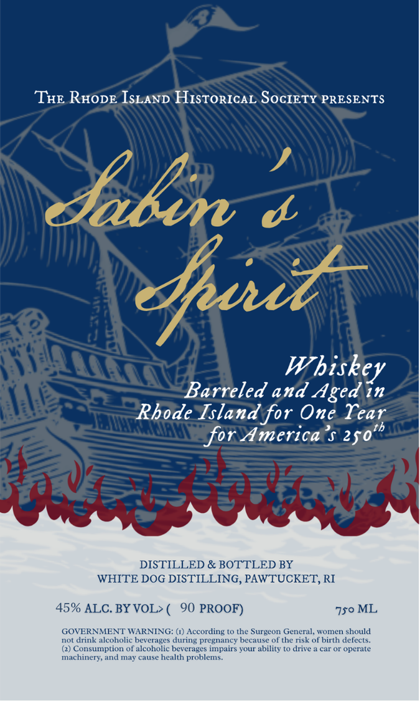

# TTB COLA Label Images - TTBID 26085001000479

**Brand Name:** WHITE DOG DISTILLING

**Fanciful Name:** SABIN'S SPIRIT

**Issue Date:** 03/26/2026

**Origin Code:** 40

**Product Class/Type:** 140

**Source:** [TTB Public COLA Registry](https://ttbonline.gov/colasonline/viewColaDetails.do?action=publicFormDisplay&ttbid=26085001000479)

## Label Images

### Label 1

## Extracted Label Text

*Text extracted via OCR - may contain errors*

**Detected Proof:** 90

### Label 1

THE RHODE ISLAND HISTORICAL SOCIETY PRESENTS
Jabin
1
Whiskey
Barreled and Aged in
Rhode Island for One Tear
tb
for America
250'
eOn
DISTILLED & BOTTLED BY
WHITE DOG DISTILLING, PAWTUCKET; RI
45% ALC. BY VOL>
90 PROOF)
750 ML
GOVERNMENT WARNING: 6) According t0 the Surgeon General, women should
not drink alcoholic beverages during pregnancy because of the risk of birth defects:
Consumption of alcoholic beverages impairs your ability t0 drive
car or operate
machinery, and may cause health problems.
duz
