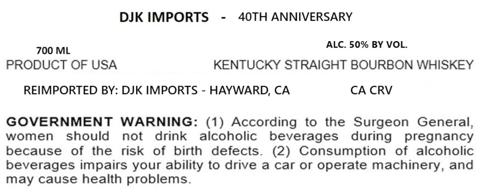
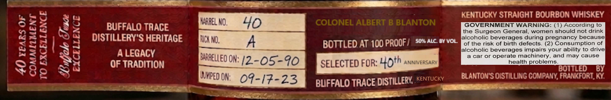
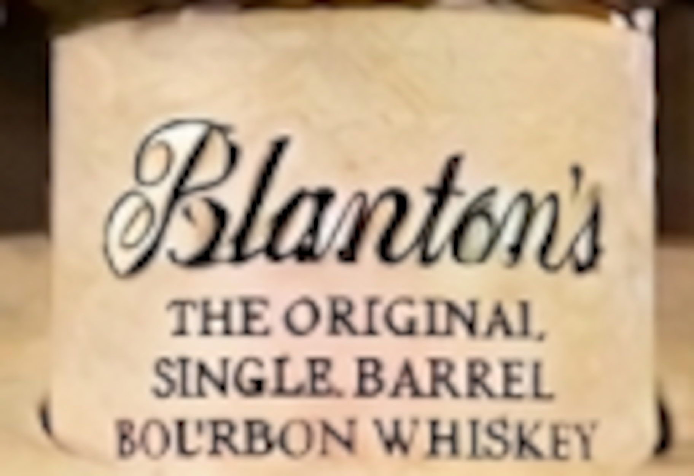

# TTB COLA Label Images - TTBID 26085001000497

**Brand Name:** DJK IMPORTS

**Issue Date:** 03/31/2026

**Origin Code:** 00

**Product Class/Type:** 101

**Source:** [TTB Public COLA Registry](https://ttbonline.gov/colasonline/viewColaDetails.do?action=publicFormDisplay&ttbid=26085001000497)

## Label Images

### Back Label

### Label 2

### Label 3

## Extracted Label Text

*Text extracted via OCR - may contain errors*

**Detected Proof:** 100

### Back Label

DJK IMPORTS
40TH ANNIVERSARY
ALC. 50% BY VOL.
700 ML
PRODUCT OF USA
KENTUCKY STRAIGHT BOURBON WHISKEY
REIMPORTED BY: DJK IMPORTS
HAYWARD, CA
CA CRV
GOVERNMENT
WARNING:
(1) According
to
the Surgeon
General
1
women
should
not
drink
alcoholic
beverages
during
pregnancy
because
of
the
risk
of
birth
defects_
(2)
Consumption
of
alcoholic
beverages impairs your ability to drive
a
car or
operate machinery, and
may cause health problems.

### Label 2

40) ¥PARS OF

COMMILMENT
TO EXCELLENCE

Lufficle Siace

EXCELLENCE

eee naan Ease
BUFFALO TRACE MAIELNO. 4
DISTILLERY'S HERITAGE [itn A
A LEGACY ye
OF TRADITION tO ON: 12-05-90

MWPED ON: OF-/F-23

- a ats

eee
KENTUCKY STRAIGHT BOURBON WHISKEY

GOVERNMENT WARNING: (1) According to
the Surgeon General, women should not drink
alcoholic beverages during pregnancy because

of the risk of birth defects. (2) Consumption of
alcoholic beverages impairs your ability to drive
a car or operate machinery, and may cause
health problems.
LED BY

. BOTT
BLANTON'S DISTILLING COMPANY, FRANKFORT, KY
CURA

BOTTLED AT 100 PROOF/ 0% Ac sv vot.

SELECTED FOR: Uoth ANNIVERSARY

“1ZY
-INT
:

BUFFALO TRACE DISTILLERY, ‘“\".:
=~ —

### Label 3

8Rlantons
THE ORIGINAL
SINGLE BARREL
BOLRBON WHISKEY
