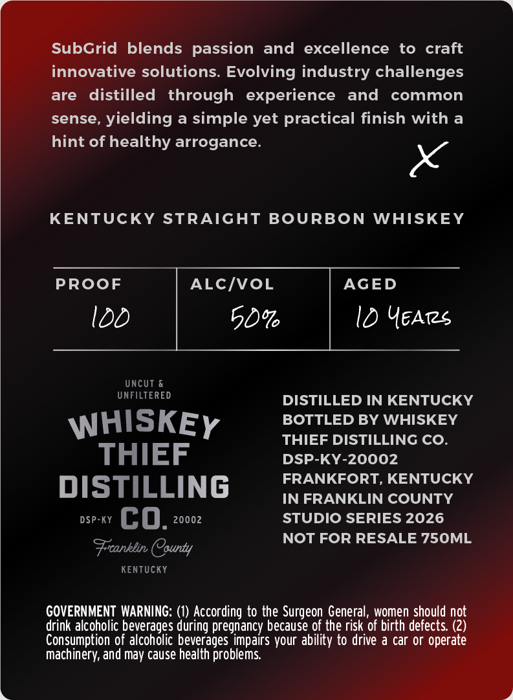

# TTB COLA Label Images - TTBID 26085001000529

**Brand Name:** WHISKEY THIEF DISTILLING CO.

**Fanciful Name:** SUBGRID

**Issue Date:** 04/03/2026

**Origin Code:** 22

**Product Class/Type:** 101

**Source:** [TTB Public COLA Registry](https://ttbonline.gov/colasonline/viewColaDetails.do?action=publicFormDisplay&ttbid=26085001000529)

## Label Images

### Back Label

### Label 2

## Extracted Label Text

*Text extracted via OCR - may contain errors*

*1 image(s) excluded: text did not meet readability threshold*

**Detected Proof:** 100

### Back Label

SubGrid blends passion and
excellence
to
craft
innovative solutions. Evolving industry challenges
are
distilled
through  experience
and
common
sense,
yielding a simple yet practical finish with
hint of healthy arrogance.
KENTUCKY STRAIGHT
BOURBON
WHISKE
PROoF
ALCIVoL
AGED
Idd
50%
0 YEATs
UncUt &
UNFILTERED
DISTILLED IN KENTUCKY
WHISKEY
BOTTLED BY WHISKEY
THIEF DISTILLING CO.
THIEF
DSP-KY-20002
FRANKFORT, KENTUCKY
DISTILLING
IN FRANKLIN COUNTY
DSP-KY
cO_
20002
STUDIO SERIES 2026
NOT FOR RESALE 750ML
County
KENTUCKY
GOVERNMENT  WARNING:
According to the Surgeon General, women should not
drink alcoholic beverages during pregnancy because of the risk of birth defects (2)
Consumption of alcoholic beverages impairs your ability to drive a car or operate
machinery, and may cause health problems:
Stanklin
