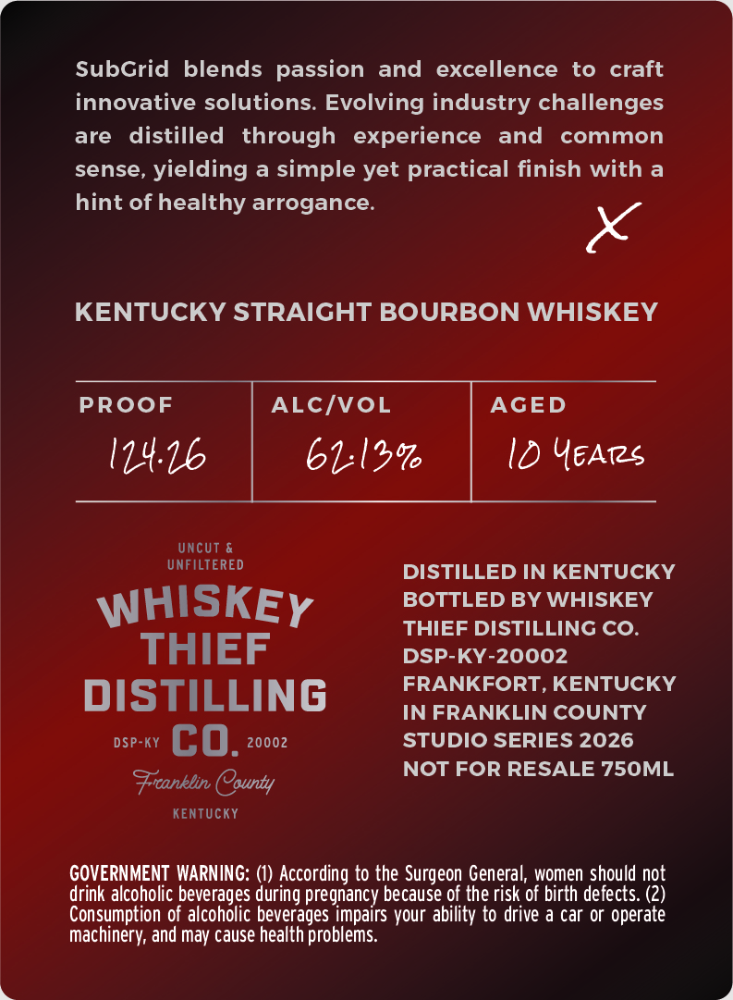
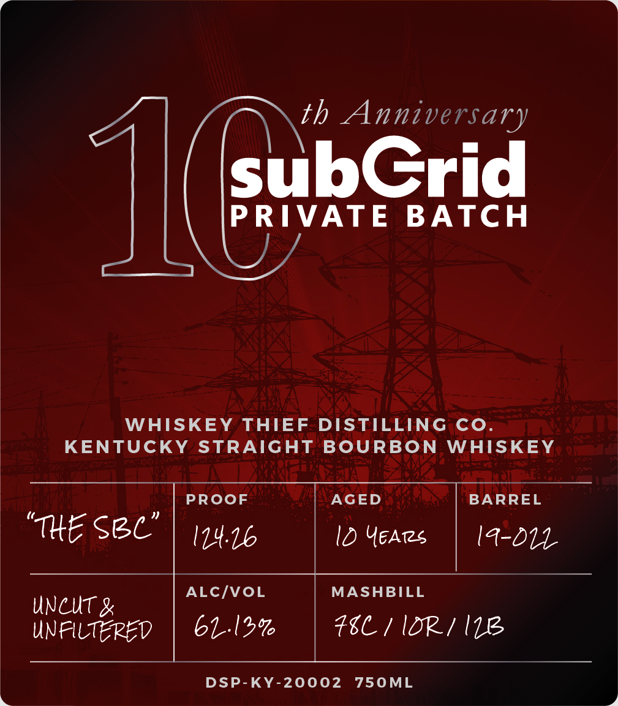
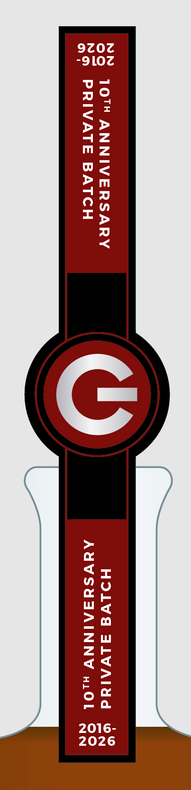

# TTB COLA Label Images - TTBID 26085001000533

**Brand Name:** WHISKEY THIEF DISTILLING CO

**Fanciful Name:** SUBGRID

**Issue Date:** 04/06/2026

**Origin Code:** 22

**Product Class/Type:** 101

**Source:** [TTB Public COLA Registry](https://ttbonline.gov/colasonline/viewColaDetails.do?action=publicFormDisplay&ttbid=26085001000533)

## Label Images

### Back Label

### Front Label

### Label 3

## Extracted Label Text

*Text extracted via OCR - may contain errors*

### Back Label

SubGrid blends passion and
excellence
to craft
innovative solutions. Evolving industry challenges
are
distilled
through  experience
and
common
sense,
yielding a simple yet practical finish with
hint of healthy arrogance.
KENTUCKY STRAIGHT BOURBON WHISKEY
PROoF
ALcIvoL
AGED
114.16
61121
ID YeArs
Uncut &
UNFILTERED
DISTILLED IN KENTUCKY
WHISKEY
BOTTLED BY WHISKEY
THIEF DISTILLING CO_
THIEF
DSP-KY-20002
FRANKFORT, KENTUCKY
DISTILLING
IN FRANKLIN COUNTY
DSP-KY
co.
20002
STUDIO SERIES 2026
NOT FOR RESALE 750ML
Frcanklin County
KenTUcKY
GOVERNMENT  WARNING:
According to the Surgeon General, women should not
drink alcoholic beverages
pregnancy because of the risk of birth defects: (2)
Consumption of alcoholic beverages impairs your ability to drive a car or operate
machinery, and may cause health problems
during

### Front Label

th Anniversary
JLC
subGrid
PRIVATE
BATCH
WHISKEY
THIEF
DISTILLING
Co
KENTUCKY
STRAIGHT
BOURBON
WHISKEY
PROoF
AGED
BARREL
"Tte Sre"
I14.6
Id YEATs
Ia-b14
ALCIvoL
MASHBILL
UNCUT
unfilteped
61.12%6
#8C / IDp/ W11
DSP-KY-20002
750ML

### Label 3

SS 107 ANNIVERSARY HOLVd ALVAIUd
I
ar

PRIVATE BATCH AUYVSHAAINNY wiOL
