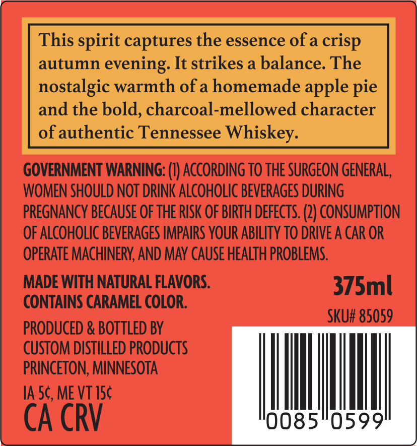
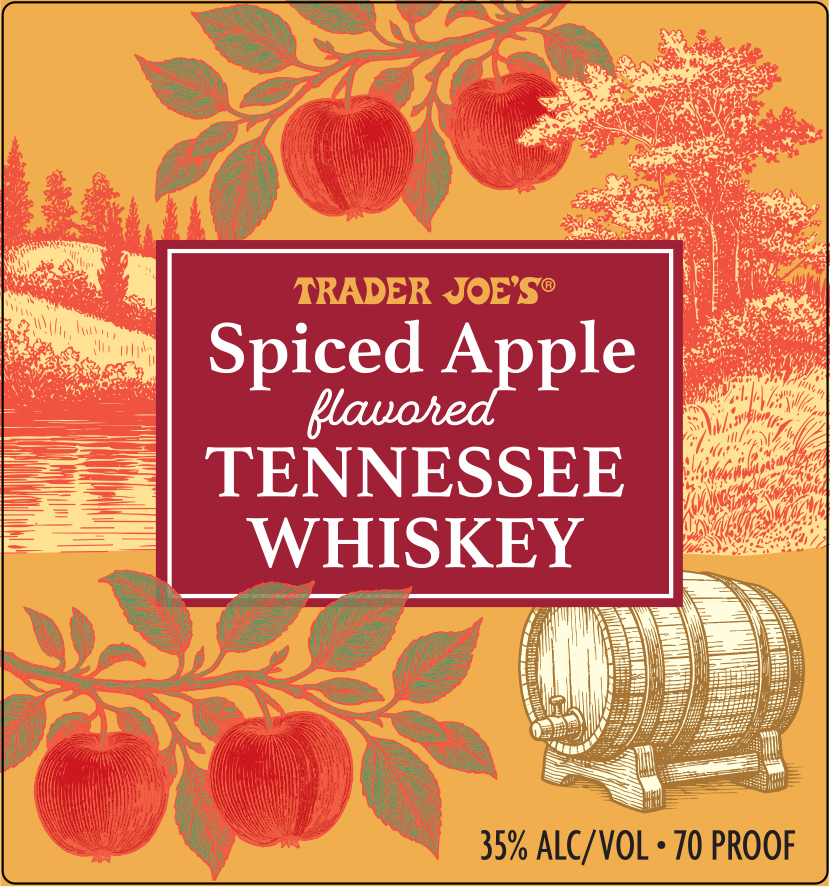

# TTB COLA Label Images - TTBID 26085001000608

**Brand Name:** TRADER JOE'S

**Issue Date:** 03/27/2026

**Origin Code:** 27

**Product Class/Type:** 149

**Source:** [TTB Public COLA Registry](https://ttbonline.gov/colasonline/viewColaDetails.do?action=publicFormDisplay&ttbid=26085001000608)

## Label Images

### Back Label

### Label 1

## Extracted Label Text

*Text extracted via OCR - may contain errors*

**Detected Proof:** 70

### Back Label

This spirit captures the essence of a crisp
autumn evening. It strikes a balance. The
nostalgic warmth of a homemade apple pie
and the bold, charcoal-mellowed character
of authentic Tennessee Whiskey.

GOVERNMENT WARNING: (1) ACCORDING TO THE SURGEON GENERAL,

WOMEN SHOULD NOT DRINK ALCOHOLIC BEVERAGES DURING

PREGNANCY BECAUSE OF THE RISK OF BIRTH DEFECTS. (2) CONSUMPTION

OF ALCOHOLIC BEVERAGES IMPAIRS YOUR ABILITY TO DRIVE A CAR OR

OPERATE MACHINERY, AND MAY CAUSE HEALTH PROBLEMS.

MADE WITH NATURAL FLAVORS.

CONTAINS CARAMEL COLOR. Sent

PRODUCED & BOTTLED BY

CUSTOM DISTILLED PRODUCTS

PRINCETON, MINNESOTA

cACRV

### Label 1

TRADER JOES@
Spiced Apple
Qlauohed
TENNESSEE
WHISKEY
35% ALC/VOL
70 PROOF
