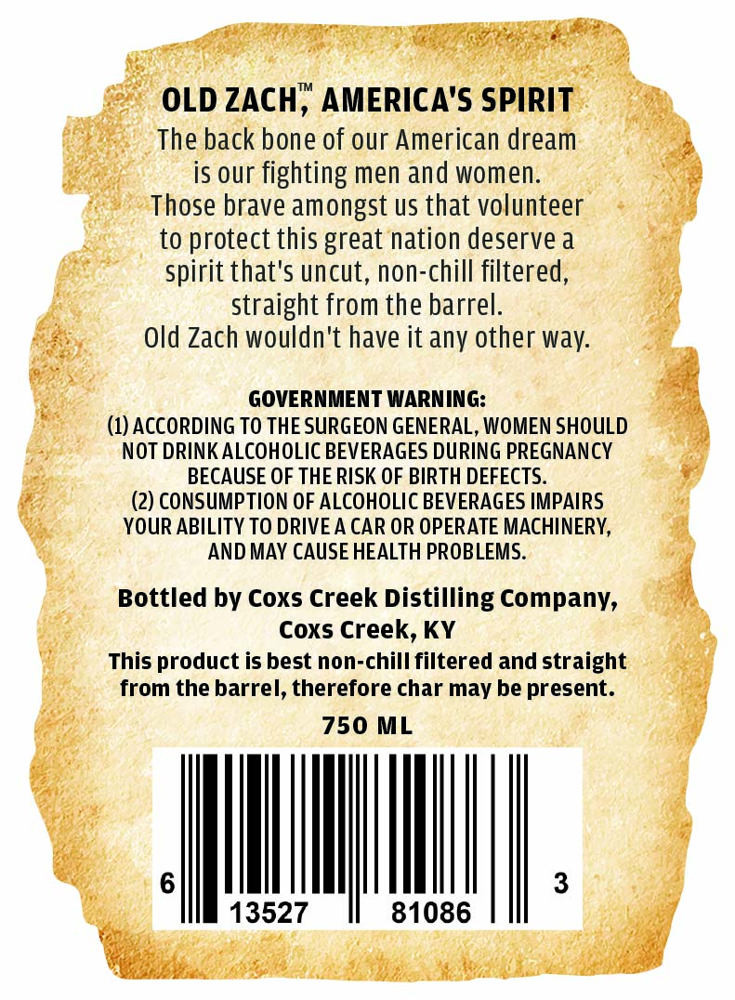
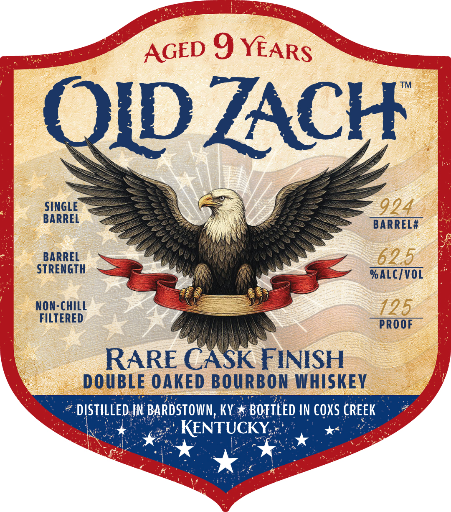

# TTB COLA Label Images - TTBID 26085001000630

**Brand Name:** OLD ZACH

**Fanciful Name:** RARE CASK FINISH DOUBLE OAKED BOURBON WHISKEY

**Issue Date:** 03/27/2026

**Origin Code:** 22

**Product Class/Type:** 141

**Source:** [TTB Public COLA Registry](https://ttbonline.gov/colasonline/viewColaDetails.do?action=publicFormDisplay&ttbid=26085001000630)

## Label Images

### Back Label

### Front Label

## Extracted Label Text

*Text extracted via OCR - may contain errors*

### Back Label

ifs

OLD ZACH™ -AMERIC

bey

pty

The back bone of our American dream

hee

ai

is our fighting men and women.

a

' Those brave amongst us that volunteer

oo

to protect this great nation deserve a

spirit that's uncut, non-chill filtered

straight from the barrel

Old Zach wouldn't have it any other way.

GOVERNMENT WARNING

(1) ACCORDING TO THE SURGEON GENERAL, WOMEN SHOULD

a

NOT DRINK ALCOHOLIC BEVERAGES DURING PREGNANCY

La eae

BECAUSE OF THE RISK OF BIRTH DEFECTS

BA

(2) CONSUMPTION OF ALCOHOLIC BEVERAGES IMPAIRS

YOUR ABILITY TO DRIVE A CAR OR OPERATE MACHINERY,

AND MAY CAUSE HEALTH PROBLEMS.

hee.

a

Bottled by Coxs Creek Distilling Company,

2

Coxs Creek, KY

This product is best non-chill filtered and straight

from the barrel, therefore char may be ee

750 ML

te

ees

MM).

|

13527

81086

#2

Bes

TAGE

Of

resin

### Front Label

AGED 9
QWZACH
SINGLE
924
BARREL
BARREL #
BARREL
62.5
STRENGTH
%ALC/VOL
Non-CHILL
125
FILTERED
PROOF
RARE CAK FINISH
DOUBLE OAKED BOURBON WHISKEV
DISTILLED IN BARDSTOWN, kV
BOTTLED IN COXS CREEk
KENTUCKY
YEARS
