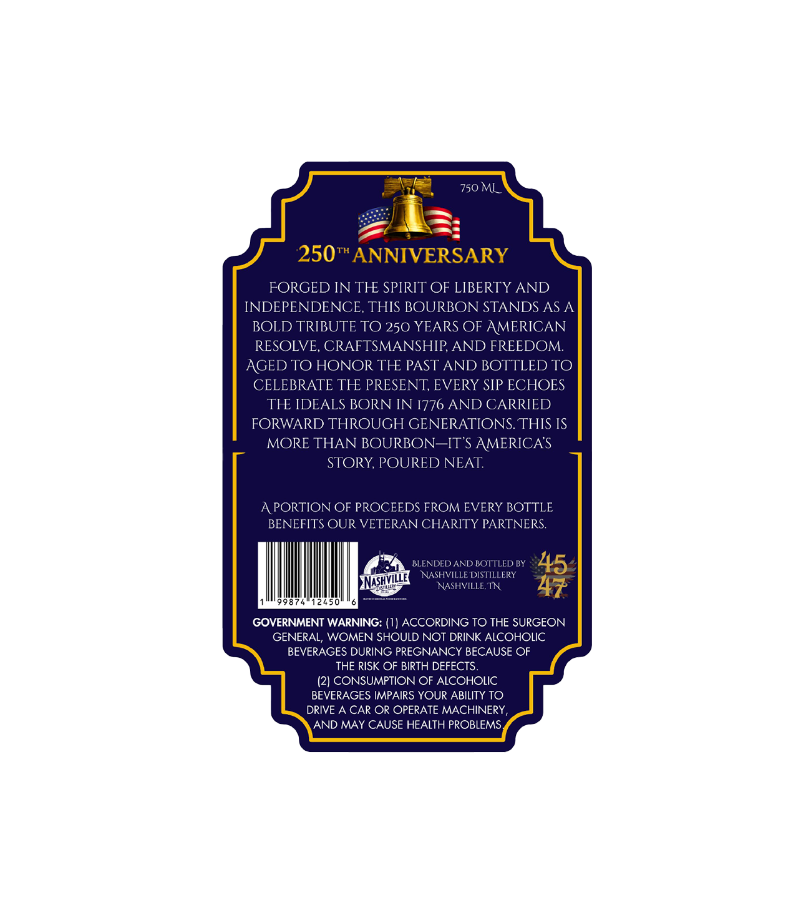
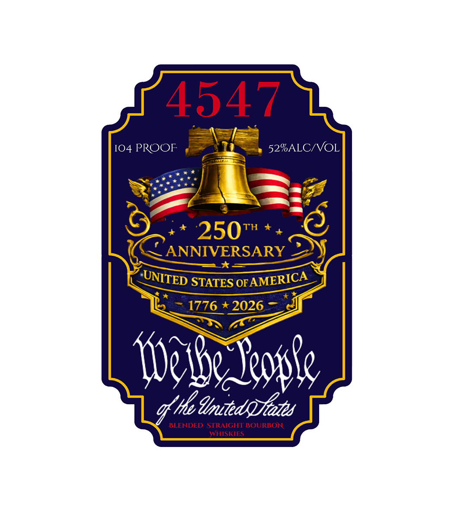

# TTB COLA Label Images - TTBID 26085001000631

**Brand Name:** 4547

**Issue Date:** 03/27/2026

**Origin Code:** 43

**Product Class/Type:** 121

**Source:** [TTB Public COLA Registry](https://ttbonline.gov/colasonline/viewColaDetails.do?action=publicFormDisplay&ttbid=26085001000631)

## Label Images

### Back Label

### Front Label

## Extracted Label Text

*Text extracted via OCR - may contain errors*

**Detected Proof:** 104

### Back Label

750 ML
250*"ANNIVERSARY
FORGED IN TH SPIRIT OF LIBERTY AND
INDEPENDENCE, THIS BOURBON STANDS AS A
BOLD TRIBUTE TO 250 YEARS OF AMERICAN
RESOLVE, CRAFTSMANSHIP AND FREEDOM
AGED TO HONOR TH PAST AND BOTTLED TO
CELEBRATE TH PRESENT, EVERY SIP ECHOES
TH IDEALS BORN IN 1776 AND CARRIED
FORWARD THROUGH GENERATIONS THIS IS
MORE THAN BOURBON-IT'$ AMERICAS
STORY, POURED NEAT
APORTION OF PROCEEDS FROM EVERY BOTTLE
BENEFITS OUR VETERAN CHARITY PARTNERS
BLENDED AND BOTTLED BY
NASHYSHVIDSTTALERY
45
GOVERNMENT WARNING: (1) ACCORDING TO THE SURGEON
GENERAL; WOMEN SHOULD NOT DRINK ALCOHOLIC
BEVERAGES DURING PREGNANCY BECAUSE OF
THE RISK OF BIRTH DEFECTS_
(2) CONSUMPTION OF ALCOHOLIC
BEVERAGES IMPAIRS YOUR ABILITY TO
DRIVE A CAR OR OPERATE MACHINERY
AND MAY CAUSE HEALTH PROBLEMS
NNASHVILLE

### Front Label

4547
I04 PROOF
52%ALCIVOL
250
TH
ANNIVERSARY
t*
STATES OF
1776
2026
lephe Jeople
'Fe dmitedqIats
BLENDED
STRAIGHT BOURBON
WHISKIES
UNITED
AMERICA
