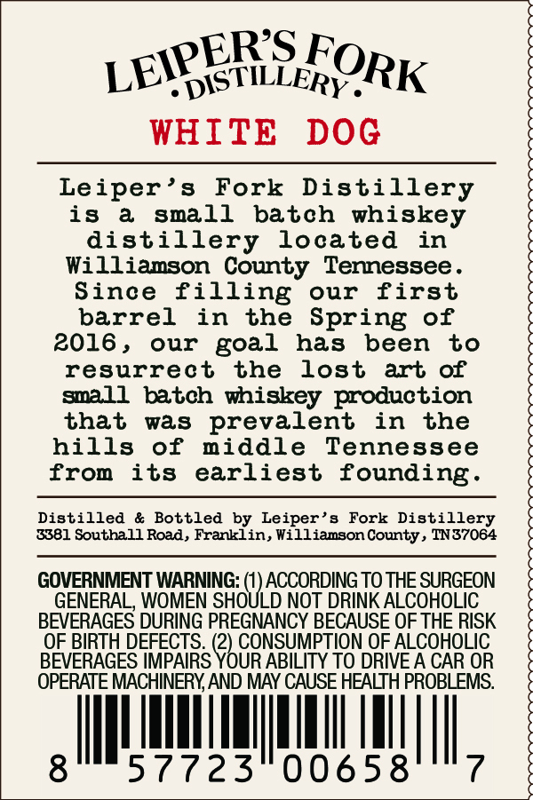
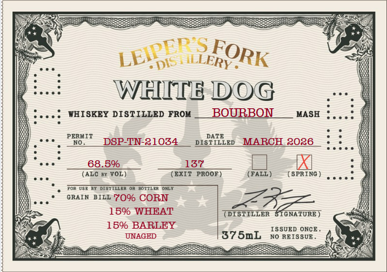
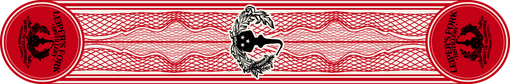

# TTB COLA Label Images - TTBID 26085001000655

**Brand Name:** LEIPER'S FORK DISTILLERY

**Fanciful Name:** WHITE DOG WHISKEY

**Issue Date:** 05/15/2026

**Origin Code:** 43

**Product Class/Type:** 140

**Source:** [TTB Public COLA Registry](https://ttbonline.gov/colasonline/viewColaDetails.do?action=publicFormDisplay&ttbid=26085001000655)

## Label Images

### Back Label

### Label 1

### Label 3

## Extracted Label Text

*Text extracted via OCR - may contain errors*

### Back Label

:DISTILLERY _
WHITE
DOG
Leiper' s
Fork Distillery
1s
a
sma1l
batch whiskey
distillery
located
in
Williamson County Tennessee _
Since filling
our
first
barrel
in
the Spring of
2016 ,
our
goal
has
been
to
resurrect
the
lost
art of
small
batch
whiskey production
that
was
prevalent
in
the
hills
of
middle
Tennessee
from
its
earliest founding_
Distilled
& Bottled
by Leiper
Fork Distillery
3381 Southall Road, Franklin, Hilliamson County_
TN37064
GOVERNMENT WARNING: (1) ACCORDING TO THE SURGEON
GENERAL WOMEN SHOULD NOT DRINK ALCOHOLIC
BEVERAGES DURING PREGNANCY BECAUSE OF THE RISK
OF BIRTH DEFECTS_
CONSUMPTION OF ALCOHOLIC
BEVERAGES IMPAIRS
PoCr1
ABILITY TO DRIVE A CAR OR
OPERATE MACHINERY AND MAY CAUSE HEALTH PROBLEMS:
8
57723
00658
LEIPERS _
FORK

### Label 1

DIS H ILLERY .
WHITE DOG
WHISKEY DISTILLED FROM
BOLBON
MASH
PERMIT
DATE
DSPTN-21034
DISTILLED
MARCH 2026
68.50
137
(ALC Bx VOL )
(EXIT
PROOF )
(FALL )
(SPRING
DISTILLeR
BOTILE
GRAIN BILL
709 CORN
159 WHEAT
DISTILLER
STGNATURE )
159 BARLEY
ISSUED ONCE
UNAGED
37 SmL
NO REISSUE
LEIDEES
FORK

### Label 3

aagsIELIO Tras

Rid

isa

LEER SPOR

Sd.

re
WL TER NT
