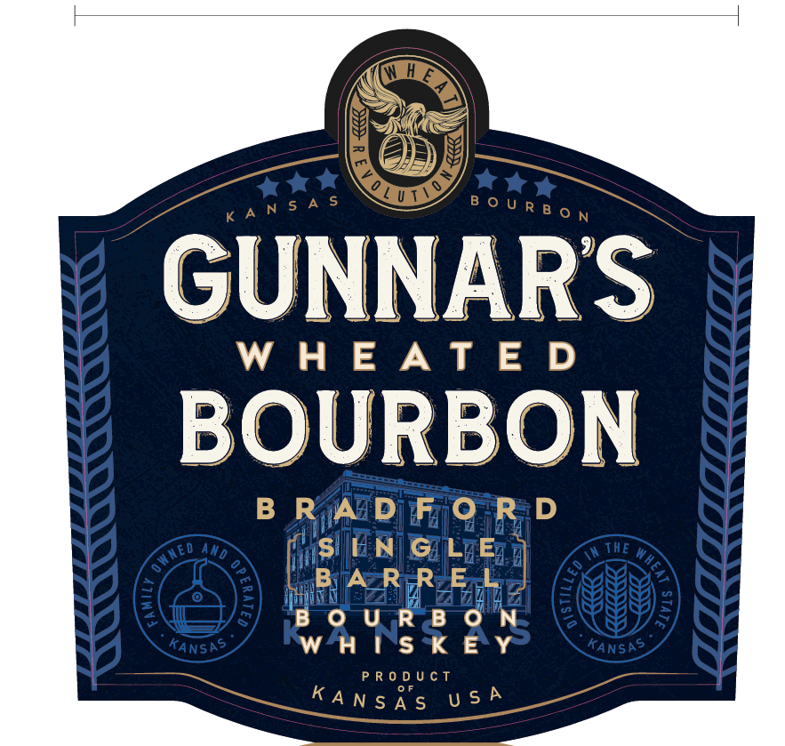
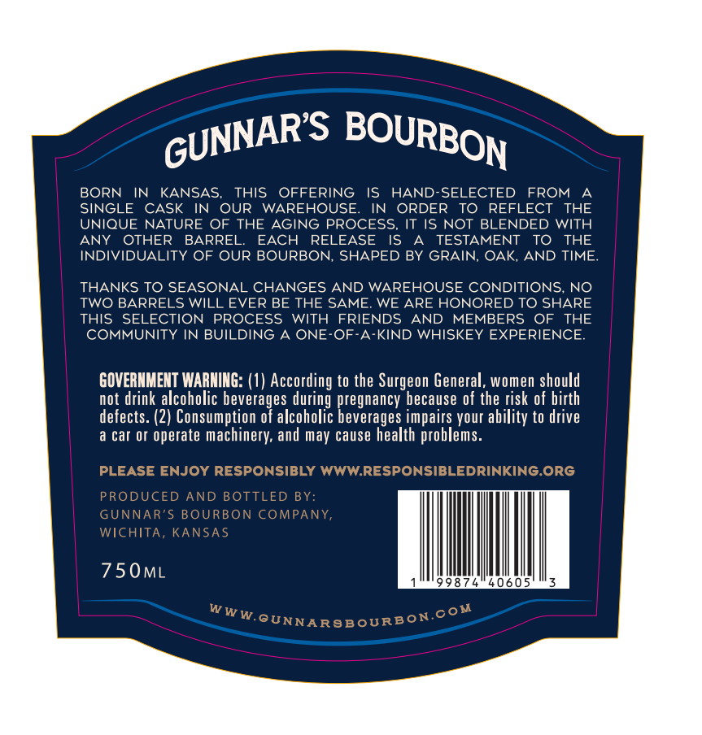
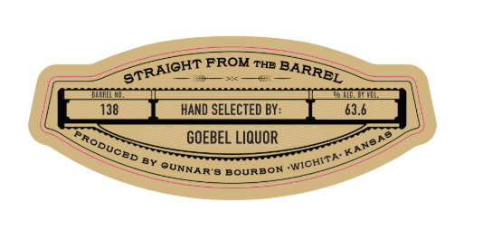
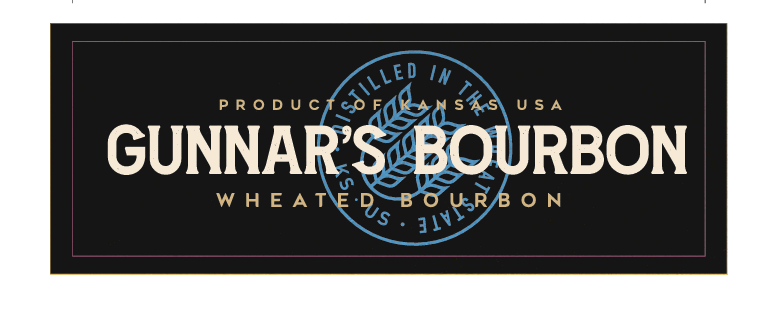

# TTB COLA Label Images - TTBID 26085001000669

**Brand Name:** GUNNAR'S WHEATED BOURBON - BRADFORD SINGLE BARREL - BARREL PICK

**Issue Date:** 03/27/2026

**Origin Code:** 21

**Product Class/Type:** 141

**Source:** [TTB Public COLA Registry](https://ttbonline.gov/colasonline/viewColaDetails.do?action=publicFormDisplay&ttbid=26085001000669)

## Label Images

### Label 1

### Label 2

### Label 3

### Label 4

## Extracted Label Text

*Text extracted via OCR - may contain errors*

*1 image(s) excluded: text did not meet readability threshold*

### Label 1

WHEATED
wy oD FON R-
Pa rent ae Lb
SO) Wen Koee
1: lea ee
ICY s/ WOGouURS ON 2 KS
ANSRe Wa [U°SK &°Y Kansne,

### Label 2

BORN
IN
KANSAS,
ThIS
OFFERING
IS
HAND-SELECTED
FROM
SINGLE
CASK
IN
OUR WAREHOUSE
IN
ORDER
To
REFLECT
THE
UNIQUE NATURE OF THE AGING PROCESS_
IT IS NOT BLENDED WITH
ANY
OTHER
BARREL
EACH
RELEASE
IS
TESTAMENT
TO
THE
INDIVIDUALITY OF OUR BOURBON, SHAPED BY GRAIN, OAK,
AND TIME:
THANKS TO SEASONAL CHANGES AND WAREHOUSE CONDITIONS; NO
TWO BARRELS WILL EVER BE THE SAME: WE ARE HONORED TO SHARE
THIS
SELECTION PROCESS
WITH FRIENDS
AND
MEMBERS
OF
THE
COMMUNITY IN BUILDING A ONE
OF-A-KIND WHISKEY EXPERIENCE
GOVERNMENT WARNING: (1) According to the Surgeon General, women should
not drink alcoholic beverages
pregnancy because of the risk of birth
defects: (2) Consumption of alcoholic beverages impairs your ability to drive
a car 0r
operate machinery; and
cause health problems_
PLEASE ENJOY RESPONSIBLY WWWRESPONSIBLEDRINKING ORG
PRODUCED AND BOTTLED BY:
GUNNAR'S BOURBON COMPANY,
WICHITA, KANSAS
750ML
98
WWW.GUNNARGBOURBON coM
GUNNARS
BOURBON
during
may

### Label 3

FROM
ernnient FROM™ BARRE
ee eee nae
[138 iano sevecreo bys 63s]
—
Free GOEBEL LIOUOR Za
~ & SUNNAR's BOURBON eee
