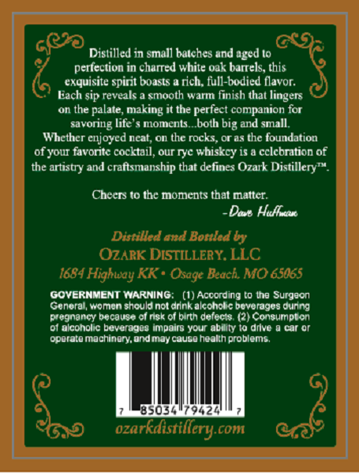
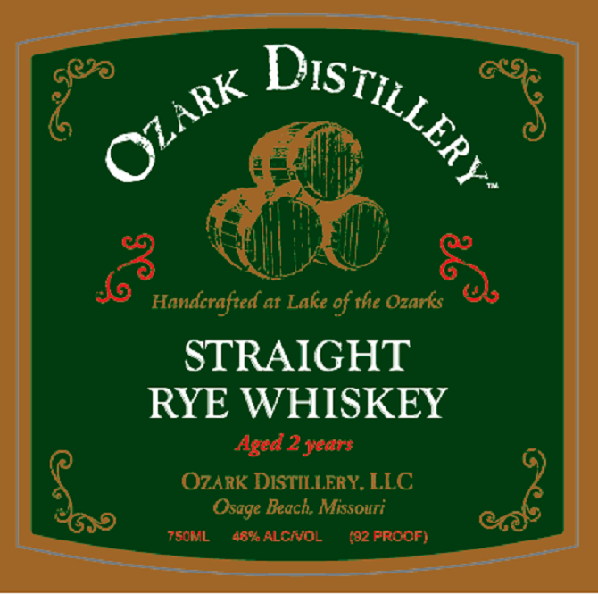

# TTB COLA Label Images - TTBID 26085001000739

**Brand Name:** OZARK DISTILLERY

**Issue Date:** 03/27/2026

**Origin Code:** 29

**Product Class/Type:** 102

**Source:** [TTB Public COLA Registry](https://ttbonline.gov/colasonline/viewColaDetails.do?action=publicFormDisplay&ttbid=26085001000739)

## Label Images

### Back Label

### Label 1

## Extracted Label Text

*Text extracted via OCR - may contain errors*

**Detected Proof:** 92
**Detected Age:** 2 Years

### Back Label

0s
Distilled in small batches and aged t0
perfection in charred white oak barrels; this
exquisite spirit boasts
rich: full-bodied flavor:
Each sip reveals
smooth warm finish that lingers
on the palate, making
the perfect companion for
savoring life'
moments_both big and small.
Whether enjoyed neat; on thc rocks; oras the foundation
of YOuI favoritc cocktail, our Tyc whiskcy is
cclcbration of
the artisty and craftsmanship that defines Ozark Distillery
Cbecrs t0 Ihe moments that maltcr;
Dovt Huflfetaut
Distilled and Bottled by
OzARK DISTILLERY. LLC
1684 Highway KK * Osage Beach  MO 65065
GOVERNMENT WARNING   (1) According t0 Ine Surgeon
Goneral, Womon should nol drink akccholc bovorvges Jurng
pregnancy Decause ol risk of birth defects (2
Conguinpion
ot alconolic beverages impairg your abbity t0 drive
car Or
operate machinery  ondmay cause health problems.
(9424
ozarkaistillery
Com
@

### Label 1

Jo
Handcrafted at Lake of the Ozarks
STRAIGHT
RYE WHISKEY
Aged 2 years
OzARK DISTILLERY. LLC
Beach, Missouri
7s0ML
46% ALCIOL
(02 PROOF)
DISTILLER } -
OZARK
Osage
