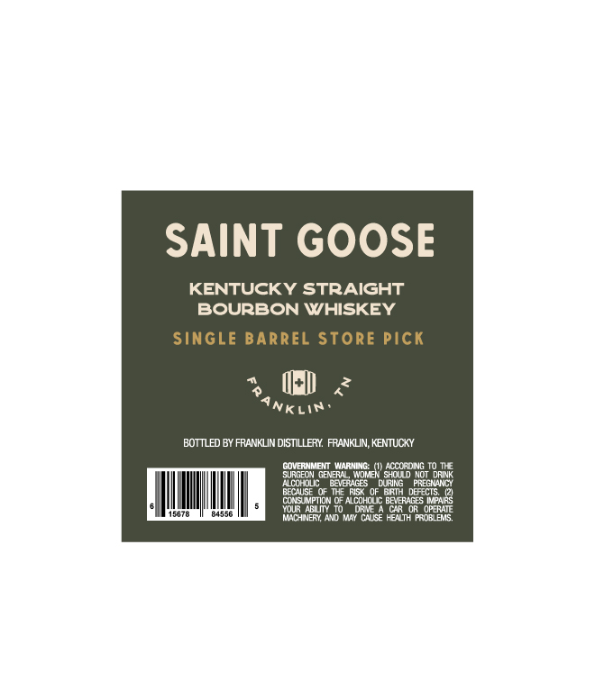
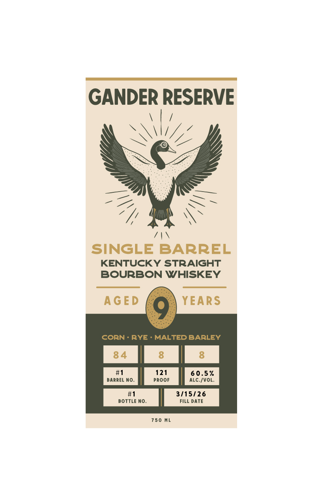

# TTB COLA Label Images - TTBID 26085001000823

**Brand Name:** GANDER RESERVE

**Issue Date:** 03/30/2026

**Origin Code:** 22

**Product Class/Type:** 101

**Source:** [TTB Public COLA Registry](https://ttbonline.gov/colasonline/viewColaDetails.do?action=publicFormDisplay&ttbid=26085001000823)

## Label Images

### Back Label

### Front Label

## Extracted Label Text

*Text extracted via OCR - may contain errors*

**Detected Proof:** 121

### Back Label

SAINT GOOSE
KENTUCKY STRAIGHT
BOURBON WHISKEY
Single BarreL Store Pick
<
Nklin
BOTTLED BY FRANKLIN DISTILLERY FRANKLIN; KENTUCKY
CovERNMENT WArNLG
Moae" SeCGoD No
SURGEON GENVER
ShouD NO
DRINK
AcohWLIC
BEVEAGES
DuPILG
PRECNAGI
Betaise
MHE RISk
BRTH DFFECTS
Cunsicipmun
hcohouc BEVERAGES WPNRS
Mop
AFM
Oper
8455p
MACHNERY And WY
CNSE HENiTHARORES

### Front Label

GANDER RESERVE
SINGLE BARREL
KENTUCKY STRAIGHT
BOURBON WHISKEY
AGED
YEARS
CORN
RYE
MALTED BARLEY
84
8
#1
121
60.5 %
BARREL No.
PRoof
ALC /VOL
#1
3/15/26
BOTTLE No_
FILL DATE
750
