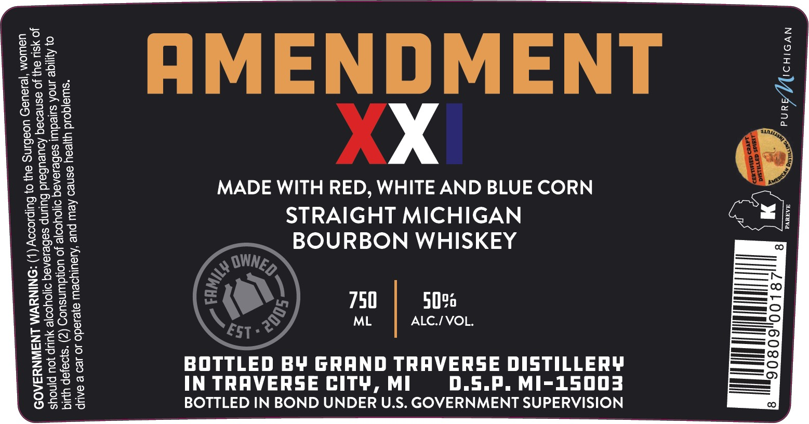

# TTB COLA Label Images - TTBID 26086001000052

**Brand Name:** AMENDMENT XXI

**Issue Date:** 03/30/2026

**Origin Code:** 06

**Product Class/Type:** 111

**Source:** [TTB Public COLA Registry](https://ttbonline.gov/colasonline/viewColaDetails.do?action=publicFormDisplay&ttbid=26086001000052)

## Label Images

### Back Label

### Label 1

## Extracted Label Text

*Text extracted via OCR - may contain errors*

### Back Label

our story
grew up on a
family farm in
One day, in
the hayloft, I discovered three well-used whiskey jugs.
a
Polish immigrant, was putting
to
use: Fast forward to 2005. We
Grand Traverse Distillery, Northern Michigan s first
craft
We use only local
We distill
and bottle every spirit we sell: No shortcuts:
Grandpa George would be proud
Na zdrowie,
Kent Qabis
Michigan: '
Grandpa
George; '
opened
grain
good
distillery:
grains:

### Label 1

_
=
Lad
=
=
=
Lid
=
ce

*swa|qod waren asi

0} Ayiyiqe anoA suyeduu sebese.
jo yeu uy jo esnedaq Aoueuba
ual ‘jelaued UoeBINS eu}

»X

MADE WITH RED, WHITE AND BLUE CORN

Kew
12m oyOuor yo uojduinsuog (2) ‘s}o9jep UI
id Buunp sebesereq S1}OYOo|e yuup jou pjnoys
0) Bulpiocoy (|) :ONINSWM LNaIWNYaAOS

28100,

MTT

D.S.P. MI-15003

f)
BOTTLED IN BOND UNDER U.S. GOVERNMENT SUPERVISION

tt}
7

50
ALC./VOL.

750
ML

STRAIGHT MICHIGAN

BOURBON WHISKEY
BOTTLED BY GRAND TRAVERSE DISTILLERY

IN TRAVERSE CITY, MI

ue ‘Aiaulyoew eyesado JO 20 @ SAUIP
